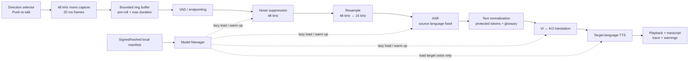

# PRD v3 — “Say It For Me”

> **Project:** Edge AI voice translation for Vietnamese ↔ Korean manufacturing communication  
> **Competition:** OneVoice AI Challenge — Phase 2 Technical Submission  
> **Document owner:** Team Lead / System Architect  
> **Updated:** 27/07/2026  
> **Status:** Working baseline for Phase 2; model and performance claims remain provisional until benchmarked
> **Phase 2 deadline:** End of 21/08/2026 (organizer email; exact cutoff time not stated)

## 0. Document decisions

This version replaces the previous sprint plan and incorporates both the formal PRD review and mentor feedback.

| Decision | v3 position |
|---|---|
| Latency `< 3 s` | A product target, not a measured claim. Report p50/p95 and the device used. |
| RAM `< 2 GB` | Removed as an unconditional promise. Initial PC gate is `< 3 GB` peak RSS; the Snapdragon gate will be set after device profiling. |
| Direction selection | Explicit `VI → KO` or `KO → VI`; automatic language detection is not in the critical path. |
| Audio processing | Frame-based capture plus VAD endpointing and bounded utterance chunks. |
| Parallelism | Bounded producer/consumer pipeline. Do not run unbounded model inference in parallel. |
| Translation model | NLLB-200-distilled-600M is Candidate A, not a final production commitment. M2M100-418M and a bilingual Marian checkpoint are benchmark candidates. |
| TTS | Piper is a Vietnamese candidate. Its official voice list does not include Korean, so Korean TTS must use another verified checkpoint. |
| Qualcomm | Qualcomm AI Hub / QNN is the Phase 3 deployment path to evaluate. ONNX Runtime and CTranslate2 are the PC baseline. |
| Scope now | Phase 2 proposal plus an evidence-oriented PC vertical slice; no claim of a finished Snapdragon prototype. |

The previous document is preserved as `PRD_SayItForMe_v2_archive.md`.

---

## 1. Product definition

### 1.1 Problem

Vietnamese operators and Korean supervisors in manufacturing environments need to exchange short operational, quality, maintenance, and safety instructions. Current workflows depend on gestures, a bilingual colleague, or a cloud translation application. They become unreliable when:

- the production floor is noisy;
- both users are wearing gloves or are hands-busy;
- internet access is weak, restricted, or prohibited;
- audio/text may not be allowed to leave the site;
- generic translation mishandles manufacturing terms.

### 1.2 Proposed solution

“Say It For Me” is a push-to-talk, offline voice translation assistant for Vietnamese ↔ Korean factory communication. The user selects the direction, records a short utterance, reviews the transcript/translation when a display is available, and hears the translated speech locally.

The product differentiator is not “one large model.” It is an auditable edge pipeline that combines explicit language direction, factory-noise handling, bounded memory, domain terminology controls, and per-stage latency/quality measurements.

### 1.3 Target users and first use cases

| User | First use case | Priority | Safety policy |
|---|---|---:|---|
| Vietnamese operator | Receive a short machine-operation or quality instruction from a Korean supervisor | P0 | Show transcript and require confirmation for safety-critical phrases |
| Korean supervisor/engineer | Give a short instruction or ask a diagnostic question | P0 | Warn when ASR confidence/quality proxy is low |
| Vietnamese technician | Explain a fault or request maintenance support | P1 | Preserve numbers, units, part IDs, and machine codes |
| Trainer / shift lead | Deliver repeatable standard-work phrases | P1 | Prefer validated phrasebook entries when available |

### 1.4 Success outcome for Phase 2

Phase 2 is successful when the submission:

1. explains a coherent AI, hardware, and software architecture;
2. separates measured evidence from targets and assumptions;
3. contains a credible model-selection and evaluation plan;
4. addresses model storage, loading, memory, chunking, failure handling, and licensing;
5. presents a feasible Phase 3 path to a portable Snapdragon prototype.

An early PC vertical slice is supporting evidence, not a Phase 2 requirement substitute.

---

## 2. Scope

### 2.1 P0 scope

- Explicit `VI → KO` and `KO → VI` direction selector.
- Push-to-talk or tap-to-start/tap-to-stop interaction.
- Fully offline runtime after models are provisioned.
- Mono audio capture; VAD-based endpointing; maximum utterance duration.
- Denoise → resample → ASR → normalization/glossary → NMT → TTS → playback.
- Text transcript and translation shown in the demo UI.
- Stage-level latency, total latency, peak RSS, and error trace recorded locally.
- Model manifest with local path, version, checksum, license, runtime, precision, and supported directions.
- One-direction PC vertical slice first; bidirectional integration after the first path is stable.

### 2.2 P1 scope

- Manufacturing glossary and protected-token handling for numbers, units, error codes, and equipment IDs.
- Reference-based evaluation for general and manufacturing subsets.
- Synthetic factory-noise evaluation at multiple SNR levels.
- Back-translation as a diagnostic only.
- Cached validated phrasebook for frequent safety and operating phrases.

### 2.3 Non-goals for Phase 2

- Claiming a verified `< 3 s` Snapdragon result before device profiling.
- Continuous open-microphone conversation.
- Speaker diarization or overlapping-speaker translation.
- Automatic language detection in the main user flow.
- Cloud APIs at runtime.
- Fine-tuning all models.
- A production-certified safety translation system.
- A final custom enclosure or production BOM.

---

## 3. User experience

### 3.1 Primary flow

1. User chooses `VI → KO` or `KO → VI`.
2. App preloads or confirms readiness of the required ASR, NMT, and target-language TTS models.
3. User presses and holds Record, or taps Start.
4. Audio frames enter a bounded ring buffer.
5. VAD detects speech start/end. The UI shows `Listening`.
6. The system finalizes an utterance on end-of-speech, user stop, or maximum duration.
7. Pipeline returns transcript, translation, audio, timings, and warnings.
8. The app plays translated audio and keeps text visible for confirmation/replay.
9. No raw audio is persisted by default. Debug recording requires an explicit opt-in.

### 3.2 States

`IDLE → PREPARING → LISTENING → FINALIZING → TRANSCRIBING → TRANSLATING → SYNTHESIZING → PLAYING → IDLE`

Any state may transition to `ERROR`, which must include a user-safe message and a machine-readable error code.

### 3.3 Safety and usability rules

- The direction is always visible while recording.
- A direction change is disabled while an utterance is in flight.
- Silence and low-energy input return `NO_SPEECH`, not hallucinated text.
- Safety-critical phrasebook matches are visually marked.
- Low-confidence or unstable output is labelled “Please repeat” rather than played as authoritative.
- Audio and text logs are disabled by default.

---

## 4. Detailed system architecture

### 4.1 Runtime data flow



DeepFilterNet processes full-band 48 kHz audio, so the pipeline must not declare its denoiser input as 16 kHz. ASR receives a separate 16 kHz resampled buffer.

### 4.2 Audio framing and chunking

Initial values are configuration defaults to benchmark, not universal truths.

| Parameter | Initial value | Reason |
|---|---:|---|
| Capture sample rate | 48 kHz mono | Compatible with the DeepFilterNet candidate |
| Frame size | 20 ms | Suitable for responsive VAD/audio processing |
| Pre-roll | 200 ms | Avoid clipping the first phoneme |
| End-of-speech silence | 400 ms | Balance responsiveness and premature cuts |
| Soft segment target | 2–4 s | Keeps inference units bounded |
| Maximum utterance | 8 s | Controls latency and memory |
| Queue capacity | 2 finalized segments | Applies backpressure |
| In-flight heavy inference | 1 by default | Prevents peak-RAM spikes on edge devices |

Audio is not naively divided at fixed timestamps. VAD/silence boundaries are preferred. If the maximum duration is reached, the segmenter cuts at the best recent silence and carries a small overlap/context marker.

The architecture allows capture of the next segment while the previous segment is being finalized. ASR/NMT/TTS results remain ordered. Parallel inference of multiple heavy segments is an experiment behind a configuration flag, not the default.

### 4.3 Module contracts

```python
AudioFrame = {
    "pcm_f32": "float32 mono samples",
    "sample_rate_hz": 48000,
    "sequence": "monotonic int",
    "captured_at_ns": "monotonic timestamp",
}

Utterance = {
    "id": "uuid",
    "direction": "vi-ko | ko-vi",
    "pcm_f32_48k": "bounded audio buffer",
    "started_at_ns": "int",
    "ended_at_ns": "int",
}

Transcript = {
    "utterance_id": "uuid",
    "text": "str",
    "language": "vi | ko",
    "segments": "ordered list",
    "warnings": "list[str]",
}

Translation = {
    "utterance_id": "uuid",
    "source_text": "str",
    "translated_text": "str",
    "source_language": "vi | ko",
    "target_language": "ko | vi",
    "protected_tokens": "list[str]",
}

SynthesizedAudio = {
    "utterance_id": "uuid",
    "pcm_f32": "float32 mono samples",
    "sample_rate_hz": "model-specific int",
}
```

### 4.4 Model lifecycle

All runtime models are provisioned before offline use.

1. `models/manifest.json` declares model ID, revision, local path, checksum, license, runtime, precision, sample rate, and supported language/direction.
2. Startup validates the manifest and local files without network access.
3. `ModelManager` loads small audio/VAD components first.
4. ASR and NMT are lazy-loaded and warmed up before the first recording when possible.
5. Only the TTS voice for the selected target language must be resident.
6. Direction switching may unload the previous TTS voice if the memory budget requires it.
7. Stage objects are reused; per-query model construction is forbidden.
8. Shutdown releases model handles and audio devices deterministically.

### 4.5 Query orchestration and backpressure

- Each request gets an `utterance_id` and `trace_id`.
- A bounded queue rejects or delays new work when the device is busy.
- Each stage returns typed data and a `StageTiming`.
- A failed stage stops downstream work for that utterance.
- Outputs are committed in input order.
- Temporary arrays are released after the next contract has taken ownership.
- Raw audio persistence is opt-in; aggregate metrics may be stored without content.

---

## 5. Candidate models and decision gates

Model sizes below are deliberately not presented as final runtime RAM. Weight storage, tokenizer files, activation memory, runtime allocations, and backend conversions are measured separately.

| Stage | Candidate A | Candidate B | Decision evidence |
|---|---|---|---|
| Noise suppression | DeepFilterNet3 at 48 kHz | RNNoise / bypass baseline | WER/CER delta by SNR, real-time factor, CPU, added latency |
| VAD | Silero VAD | WebRTC VAD | false cut/miss rate on noisy clips, endpoint latency |
| ASR | Whisper Tiny multilingual | Whisper Base multilingual | vi/ko CER or WER, p50/p95 latency, peak RSS |
| NMT | NLLB-200-distilled-600M INT8 via CTranslate2 | M2M100-418M INT8; viable bilingual Marian checkpoint if found | chrF++, sacreBLEU, terminology accuracy, p50/p95, peak RSS, license |
| TTS Vietnamese | Piper Vietnamese ONNX | MMS-TTS Vietnamese or another licensed ONNX voice | RTF, first-audio latency, intelligibility, license |
| TTS Korean | MMS-TTS Korean or verified Korean VITS checkpoint | Another Korean ONNX/QNN-compatible voice | RTF, first-audio latency, intelligibility, license |

### 5.1 Translation decision gate

NLLB remains Candidate A because it targets multilingual and low-resource translation, but it has two material constraints:

- its model card describes it as a research model not released for production deployment;
- its CC-BY-NC license is incompatible with an unrestricted commercial product.

It may be used for a non-commercial competition prototype only after the team confirms contest and planned-use compatibility. The product roadmap must include a commercially usable replacement or licensed model.

The winner is selected by a weighted score:

- 35% chrF++ / sacreBLEU;
- 25% manufacturing terminology accuracy;
- 20% p95 latency;
- 15% peak RSS;
- 5% artifact size;
- mandatory license gate.

### 5.2 ASR decision gate

Whisper Tiny is not automatically preferred. Tiny and Base must be compared on the same vi/ko noisy and clean audio. A model passes when:

- it produces non-empty, correct-language text for both directions;
- Korean and Vietnamese CER/WER are reported separately;
- p95 post-endpoint latency and peak RSS fit the current device budget;
- failure cases are documented.

### 5.3 TTS decision gate

Piper’s official voice catalog includes Vietnamese but does not currently list Korean. The previous assumption “Piper for both languages” is removed. A Korean model is accepted only after:

- the exact checkpoint and license are recorded;
- Korean text can be synthesized offline;
- a Korean-speaking reviewer checks intelligibility on at least 20 sentences;
- real-time factor and first-audio latency are measured.

---

## 6. Performance objectives and measurement

### 6.1 Service-level objectives

| Metric | Phase 2/PC target | Status |
|---|---:|---|
| Post-utterance time to first translated audio | p50 `< 3.0 s`, p95 `< 5.0 s` for utterances ≤ 5 s | Unverified target |
| Full response completion | Report p50/p95; no hard claim yet | To measure |
| Peak process RSS | `< 3 GB` on the named PC baseline | Unverified target |
| Offline runtime | Zero network calls after provisioning | Required |
| Crash-free scripted runs | 30 consecutive utterances | Unverified target |
| Direction correctness | 100% of requests use selected direction | Required by design |

The competitive `< 3 s` figure is retained as a stretch/product target. It must not appear as an achieved result until a reproducible benchmark exists.

### 6.2 Latency budget

| Component | Initial p50 budget | Measurement boundary |
|---|---:|---|
| Endpoint finalization | 0.40 s | last speech frame → finalized utterance |
| Denoise + resample | 0.20 s | finalized buffer → ASR-ready buffer |
| ASR | 0.90 s | ASR-ready buffer → transcript |
| Normalize + NMT | 0.90 s | transcript → final translated text |
| TTS first audio | 0.50 s | translated text → playable samples |
| Orchestration overhead | 0.10 s | queueing/copying not included above |
| **Total** | **3.00 s** | speech end → first playable translated audio |

These are engineering budgets. A missed sub-budget triggers investigation; it does not justify inventing a result.

### 6.3 Benchmark protocol

- Record hardware, OS, Python/runtime versions, thread counts, precision, and model revisions.
- Separate cold start, warm start, and steady-state runs.
- Run at least 5 warm-ups and 30 measured utterances per configuration.
- Report p50, p95, maximum, and standard deviation.
- Measure process RSS before load, after each model load, and at peak inference.
- Benchmark each module alone and the end-to-end pipeline.
- Test clean audio and factory-noise mixes at 15, 10, 5, and 0 dB SNR.
- Compare denoiser-on, denoiser-off, and lightweight fallback.
- Compare quality with sacreBLEU/chrF++, terminology accuracy, and Korean human review.
- Compare to a cloud baseline only on the same audio and network condition; do not claim generic Google latency values without measurement.

---

## 7. Evaluation data

The previous 20-sentence dataset is too small for a final claim. It is retained only as a smoke set.

| Dataset | Size target | Purpose |
|---|---:|---|
| Smoke set | 20 sentence pairs | Fast integration check |
| General evaluation | ≥ 100 sentence pairs per direction | Translation quality |
| Manufacturing set | ≥ 100 sentence pairs per direction | Domain terminology and use-case fit |
| Audio set | ≥ 30 recordings per language, multiple speakers | ASR clean/noisy evaluation |
| Safety phrase set | ≥ 30 validated phrases | Critical-term preservation |

Rules:

- Use public parallel corpora with traceable licenses for general evaluation.
- Manufacturing references must be reviewed by a Korean speaker.
- Keep train/dev/test provenance separate.
- Back-translation is a diagnostic, not ground truth.
- Report sacreBLEU signature and chrF++ configuration for reproducibility.
- Measure term accuracy for units, numbers, machine IDs, stop/start verbs, and safety terms.

---

## 8. Hardware and deployment concept

### 8.1 Phase 3 candidate platform

The primary concept is a rugged handheld or lanyard device based on Qualcomm QCS6490 / RB3 Gen 2-class hardware:

- 12 dense TOPS NPU capability;
- Linux/Android support;
- audio DSP and digital microphone interfaces;
- 6 GB RAM and 128 GB storage on the RB3 Gen 2 core kit;
- a more realistic power/performance point than selecting QCS8550 solely for peak compute.

QCS8550 remains the performance fallback if profiling shows QCS6490 cannot meet latency. Final selection depends on device access, full pipeline profiling, thermal behavior, and battery calculations.

### 8.2 Prototype form factor

- Handheld/lanyard prototype, not a production enclosure.
- Physical push-to-talk button.
- Direction selector and clear status indicator.
- Microphone placed away from speaker to reduce acoustic feedback.
- 3.5 mm or Bluetooth headset option for noisy areas.
- Target battery life is an engineering goal to be calculated after measured average power; it is not yet an 8-hour claim.

### 8.3 Deployment layers

| Layer | PC evidence baseline | Phase 3 target |
|---|---|---|
| OS | Windows/Linux development machine | Qualcomm Linux or Android |
| Audio | Python audio adapter | Native audio/AAudio or ALSA |
| ASR/TTS runtime | ONNX Runtime or candidate-specific runtime | QNN/QAIRT where supported; CPU/DSP fallback |
| NMT runtime | CTranslate2 CPU baseline | Benchmark ARM64 CPU vs deployable QNN path |
| App | Python CLI/Gradio evidence UI | Native or packaged portable UI |
| Model provisioning | Local manifest and checksums | Signed language pack / local installer |

---

## 9. Delivery plan

The official Phase 2 deadline is the end of 21/08/2026. The team uses
20/08/2026 18:00 (Asia/Ho_Chi_Minh) as the internal submission target, leaving
21/08 as contingency.

| Step | Owner | Deliverable | Definition of Done |
|---|---|---|---|
| 27–29/07 — Gate 0 operations | TL; APP reviews | Named roster, role cards, exact logistics status and repository rules | Every member acknowledges one role/card; unknowns are dated blockers |
| 27–31/07 — Repository foundation | TL; specialists review affected contracts | Contracts, manifest, mock pipeline and CI mode | Repository tests pass; mock request emits machine-readable output |
| 27–30/07 — Evaluation foundation | APP; ATE reviews, TL decides gate | Strict schema/harness, approved-only selection and metric contract | Evaluator tests pass; diagnostic/official boundary is independently reviewed |
| 01–07/08 — ASR/NMT spikes | ATE; TL reviews decisions | ASR and NMT candidate evidence | Same datasets; quality, p50/p95, RSS, artifact and license recorded |
| 01–07/08 — Audio/TTS spikes | AUD; ATE reviews ASR impact | Denoise/VAD and VI/KO TTS evidence | Controlled SNR, latency/resource evidence and licenses recorded |
| 08–12/08 — One-direction integration | TL; ATE, AUD and APP contribute | Real `VI→KO` PC file pipeline | WAV → transcript → translation → output WAV with trace |
| 13–14/08 — Bidirectional rehearsal | TL; specialists contribute | `KO→VI` candidate and full-flow rehearsal or scope cut | Rehearsal result or written fallback before evidence freeze |
| 15–16/08 — System evidence | TL; each specialist owns their evidence bundle | Noise/stability, demo UI and hardware/BOM evidence | Evidence register populated; proposal v0.8 |
| 17–18/08 — Content freeze | TL; each owner signs their claims | Proposal v0.9, diagrams and reader review | No unsupported claims; all owner sections approved |
| 19–20/08 — Submission package | APP; TL approves | Final PDF/DOCX, link checks and form package | Internal approval and upload-ready package by 20/08 18:00 |
| 21/08 — Contingency/official submission | TL | Resolve upload issues and submit | Submission receipt saved before organizer cutoff |

### 9.1 Phase 3 sequence

1. Acquire/confirm target Snapdragon device.
2. Reproduce PC evidence.
3. Profile supported models on Qualcomm AI Hub.
4. Replace unsupported operators/runtimes stage by stage.
5. Re-measure latency, memory, power, and thermal behavior on device.
6. Integrate microphone/speaker and portable UI.
7. Conduct Korean-speaker and noisy-environment UAT.

---

## 10. Team responsibilities

| Role | Primary responsibility | Required evidence |
|---|---|---|
| TL / System Architect | Contracts, orchestration, proposal, ADRs, integration | Architecture, trace schema, final evidence ledger |
| ASR & Translation Engineer | ASR/NMT candidate benchmarks and quantization | Reproducible benchmark reports |
| Audio & TTS Engineer | Capture, VAD, denoise, resampling, TTS, playback | Audio quality/latency report and model license records |
| App & Integration Engineer | Direction UI, evaluation harness, dataset provenance, dashboard | Usable demo, evaluation report, no hidden auto-detect |

Every module is done only when it has:

- a standalone entry point or adapter test;
- a typed input/output contract;
- one success test and at least one failure test;
- stage timing and error reporting;
- exact model/runtime/version/license metadata;
- setup and reproduction instructions.

---

## 11. Risks and controls

| Risk | Probability | Impact | Control / exit criterion |
|---|---|---|---|
| `< 3 s` is not achievable with selected models | High | High | Benchmark early; report evidence; select smaller candidate or revise target transparently |
| Peak RAM exceeds device budget | High | High | Lazy loading, one target TTS voice, bounded queues, single heavy in-flight request, measure RSS after every load |
| Korean ASR/translation quality is weak | Medium–High | High | Korean reviewer, separate KO metrics, manufacturing references, model gate |
| Korean TTS checkpoint unavailable/incompatible | Medium | High | Verify exact model and license before proposal final; allow text-only fallback in vertical slice |
| NLLB/Piper licensing blocks commercialization | High | High | Treat as prototype candidates; maintain license inventory and commercial replacement workstream |
| Noise suppression hurts ASR | Medium | High | Compare WER/CER with denoiser on/off at each SNR; bypass when harmful |
| Naive chunking loses context | Medium | High | Prefer VAD/silence boundaries, ordered results, overlap/context marker, segment-level evaluation |
| Parallel inference increases memory/thermal load | High | High | Bounded queue; default max heavy inference = 1; enable concurrency only after profiling |
| No Snapdragon device in time | Medium | High | Confirm access immediately; separate PC evidence from on-device claims |
| No Korean-speaking reviewer | Medium | High | Recruit before D2; do not treat back-translation as human validation |
| Exact cutoff time/file constraints are unknown | Medium | High | Internal deadline 20/08 18:00; confirm upload constraints with organizer |

---

## 12. Open decisions

1. Exact 21/08 cutoff time, required file format, page/file limits, and whether external links are allowed.
2. Team member names/expertise for the proposal.
3. Snapdragon device currently available to the team.
4. Korean-speaking reviewer and availability.
5. Baseline PC hardware and OS.
6. Final Korean TTS candidate and license.
7. Whether the challenge’s prototype use is compatible with CC-BY-NC candidates.
8. Whether raw test audio may be stored and shared within the team.

---

## 13. Source notes

- OneVoice AI Challenge: <https://saigonaihub.com/OneVoiceAIChallenge>
- Qualcomm AI Hub Whisper models: <https://aihub.qualcomm.com/models/whisper_small_quantized>
- Qualcomm QCS6490 product brief: <https://docs.qualcomm.com/doc/87-28733-1/87-28733-1_REV_F_QUALCOMM_QCS6490_QCM6490_Processors_Product_Brief.pdf>
- NLLB-200-distilled-600M model card: <https://huggingface.co/facebook/nllb-200-distilled-600M>
- CTranslate2 NLLB guide and quantization notes: <https://opennmt.net/CTranslate2/guides/transformers.html#nllb>, <https://opennmt.net/CTranslate2/quantization.html>
- OpenAI Whisper model information: <https://github.com/openai/whisper>
- DeepFilterNet 48 kHz requirement: <https://github.com/Rikorose/DeepFilterNet>
- Piper official voice list and license warning: <https://github.com/OHF-Voice/piper1-gpl/blob/main/docs/VOICES.md>
