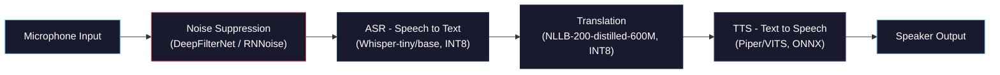
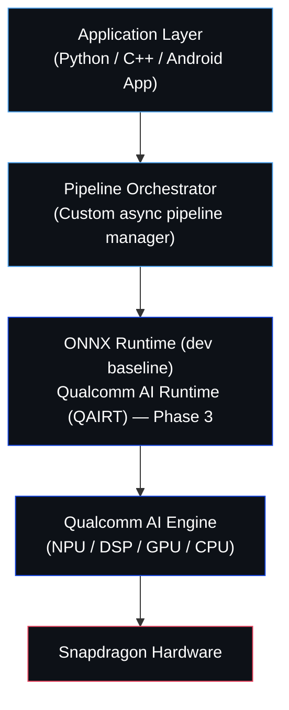

# ARCHIVE — PRD v2 "Say It For Me" | OneVoice AI Challenge

> **Project:** Say It For Me — Edge AI Voice Translation Device (VN ↔ KR)
> **Competition:** OneVoice AI Challenge (Saigon AI Hub × Qualcomm)
> **Current Phase:** Phase 2 — Technical Specification Submission (July 2026)
> **Team Size:** 4 members
> **Sprint Duration:** 1 tuần (07/07 – 13/07/2026)


---

## 1. Tổng Quan Dự Án (Project Overview)

### 1.1 Vấn đề cần giải quyết
Hàng trăm ngàn công nhân Việt Nam làm việc tại các nhà máy FDI Hàn Quốc (Samsung, LG, Hyosung, CJ...) đang gặp rào cản giao tiếp nghiêm trọng với quản lý/kỹ sư Hàn Quốc. Các giải pháp hiện tại (Google Translate, phiên dịch viên) không khả thi trong môi trường nhà máy ồn ào, bận tay, và thường không có kết nối internet ổn định.

### 1.2 Giải pháp đề xuất
Xây dựng một pipeline dịch thuật giọng nói **hoàn toàn offline**, chạy trên thiết bị Edge AI (Qualcomm Snapdragon), cho phép giao tiếp song ngữ Việt-Hàn tức thời trong môi trường nhà máy sản xuất.

> [!NOTE]
> **Sprint 1 (tuần này) chỉ nhắm tới PoC trên PC/laptop.** Việc chạy trên chính Snapdragon hardware, compile qua Qualcomm AI Hub, và tối ưu NPU là mục tiêu của **Phase 3 (Prototype)**, không phải tuần này. Điều này giúp tránh cam kết quá đà mà không có bằng chứng khi giám khảo hỏi.

### 1.3 Mục tiêu cốt lõi (Target — cho pipeline hoàn chỉnh, không chỉ Sprint 1)

| Mục tiêu | Metric | Target |
|---|---|---|
| Độ trễ end-to-end | Từ lúc nói xong → nghe bản dịch | < 3 giây |
| Độ chính xác dịch | BLEU score (VN↔KR) | ≥ 25 |
| Chạy offline | Không cần kết nối internet | 100% |
| Hoạt động trong tiếng ồn | Nhận diện giọng nói ở SNR thấp | SNR ≥ 5dB |
| Kích thước model tổng | Toàn bộ pipeline (ASR+MT+TTS) | < 2GB RAM |

---

## 2. Kiến Trúc Hệ Thống (System Architecture)

### 2.1 Sơ đồ Pipeline



### 2.2 Chi tiết từng Module

---

#### Module 1: Noise Suppression (Lọc nhiễu)

| Thuộc tính | Chi tiết |
|---|---|
| **Mục đích** | Lọc tiếng ồn nhà máy (máy móc, băng chuyền) trước khi đưa vào ASR |
| **Model chính** | **DeepFilterNet3** (ưu tiên — xử lý tiếng ồn phức tạp tốt hơn) |
| **Model dự phòng** | **RNNoise** (siêu nhẹ, dùng nếu thiếu tài nguyên) |
| **Input** | Raw audio 16kHz mono |
| **Output** | Clean audio 16kHz mono |
| **Kích thước** | RNNoise: ~85KB, DeepFilterNet3: ~5MB |
| **Latency target** | < 20ms |

> [!TIP]
> DeepFilterNet3 xử lý **non-stationary noise** tốt hơn RNNoise, nhưng tốn compute hơn đáng kể. **Quyết định (Ngày 1):** nếu tổng latency end-to-end vượt 3 giây trên máy test, fallback ngay sang RNNoise thay vì cố tối ưu DeepFilterNet3 thêm.

---

#### Module 2: ASR — Automatic Speech Recognition

| Thuộc tính | Chi tiết |
|---|---|
| **Mục đích** | Chuyển giọng nói (Việt hoặc Hàn) thành text |
| **Model** | **Whisper-tiny** (mặc định) hoặc **Whisper-base** (nếu độ chính xác tiếng Hàn không đạt) |
| **Quantization** | INT8 via ONNX Runtime (dev); Qualcomm AI Hub đánh giá cho Phase 3 |
| **Ngôn ngữ** | Vietnamese (`vi`), Korean (`ko`) + Auto language detection |
| **Input** | Clean audio 16kHz (từ Module 1) |
| **Output** | Transcribed text + detected language |
| **Kích thước (quantized)** | Whisper-tiny: ~40MB (INT8), Whisper-base: ~75MB (INT8) |
| **Latency target** | < 800ms cho câu 5 giây |

**Workflow kỹ thuật:**
1. Test cả Whisper-tiny và Whisper-base trên câu tiếng Hàn thật (Ngày 1–2) — **Whisper-tiny thường nhận diện tiếng Hàn kém hơn đáng kể so với tiếng Việt**, đây là điểm rủi ro cần xác nhận sớm.
2. Chọn phiên bản dựa trên trade-off WER vs Latency đo được, không giả định trước.
3. Quantize sang INT8 bằng ONNX Runtime quantization (dev baseline). Việc compile qua Qualcomm AI Hub / QNN là bước của Phase 3.
4. Implement **Voice Activity Detection (VAD)** bằng Silero-VAD để biết khi nào người dùng nói xong.

> [!WARNING]
> Nếu cả hai bản Whisper đều có WER quá cao cho tiếng Hàn trong môi trường ồn, fallback: dùng **Whisper-tiny + VAD chặt hơn** (câu ngắn, rõ ràng hơn) thay vì đổi sang kiến trúc ASR khác hoàn toàn trong tuần này — không đủ thời gian để thử Conformer từ đầu.

---

#### Module 3: Machine Translation (Dịch thuật)

| Thuộc tính | Chi tiết |
|---|---|
| **Mục đích** | Dịch text từ Việt sang Hàn và ngược lại |
| **Model chính (mặc định)** | **NLLB-200-distilled-600M** (Meta) |
| **Model fallback** | **M2M100-418M** hoặc **MarianMT** — chỉ dùng nếu NLLB gây OOM hoặc latency vượt ngưỡng trên máy test |
| **Quantization** | INT8 via CTranslate2 hoặc ONNX Runtime |
| **Language codes** | `vie_Latn` (Vietnamese) ↔ `kor_Hang` (Korean); M2M100 dùng `vi`/`ko` nếu fallback |
| **Input** | Source text + source language code |
| **Output** | Translated text |
| **Kích thước (INT8)** | NLLB-600M: ~300MB · M2M100-418M: ~200MB (fallback) |
| **Latency target** | < 500ms cho câu 15 từ |

> [!IMPORTANT]
> **Đã sửa so với v2:** v2 từng đề xuất M2M100-418M làm model chính với lý do "NLLB dư thừa 200 ngôn ngữ". Lý do này **không chính xác** — NLLB-200 được Meta thiết kế đặc biệt để cải thiện chất lượng dịch cho các cặp ngôn ngữ **low-resource** (VN↔KR thuộc nhóm này vì ít parallel corpus) nhờ cross-lingual transfer giữa 200 ngôn ngữ; M2M100-418M (bản nhỏ nhất của M2M100) thường dịch kém hơn NLLB cho các cặp low-resource. Việc quantize INT8 + CTranslate2 cũng không tạo overhead runtime đáng kể chỉ vì model "biết" 200 ngôn ngữ. **v3: NLLB-200-distilled-600M trở lại làm lựa chọn mặc định**, M2M100 chỉ là phương án dự phòng khi tài nguyên thực sự không đủ.

**So sánh lựa chọn (đã cân nhắc):**

| Model | Kích thước | Chất lượng cho VN↔KR (low-resource) | Phù hợp Edge? | Ghi chú |
|---|---|---|---|---|
| Aya-23-8B | Rất lớn | Tốt | Quá nặng cho edge, loại ngay |
| Qwen2.5 (translation) | Lớn | Chưa rõ | Chưa có bản tối ưu edge sẵn |
| **NLLB-200-distilled-600M** | Trung bình | **Tốt nhất** (thiết kế cho low-resource) | **Lựa chọn mặc định** |
| M2M100-418M | Nhỏ | Trung bình-thấp (bản nhỏ nhất) | Fallback nếu NLLB quá nặng |
| MarianMT | Rất nhỏ | Phụ thuộc checkpoint có sẵn | Cần kiểm tra có bilingual VN-KR checkpoint chất lượng tốt không |

**Workflow kỹ thuật:**
1. Convert NLLB sang CTranslate2 format (model chính):
   ```bash
   ct2-transformers-converter --model facebook/nllb-200-distilled-600M \
     --quantization int8 --output_dir nllb-ct2-int8
   ```
2. Đo BLEU + latency + RAM thực tế trên máy test. Nếu RAM/latency vượt ngưỡng mục 1.3/2.4, mới thử M2M100-418M làm fallback.
3. Chốt model chính thức cuối Ngày 2 dựa trên số liệu đo được, ưu tiên NLLB trừ khi có lý do kỹ thuật rõ ràng để đổi.

> [!NOTE]
> Để đạt BLEU cao hơn cho **domain manufacturing**, chuẩn bị một bộ từ vựng chuyên ngành (glossary) để post-process kết quả dịch — áp dụng được cho bất kỳ model nào được chọn.

---

#### Module 4: TTS — Text-to-Speech

| Thuộc tính | Chi tiết |
|---|---|
| **Mục đích** | Tổng hợp giọng nói từ text đã dịch |
| **Model chính** | **Piper TTS** (VITS-based, ONNX) |
| **Model dự phòng** | **MeloTTS** (có sẵn trên Qualcomm AI Hub) |
| **Ngôn ngữ** | Vietnamese voice + Korean voice |
| **Input** | Translated text + target language |
| **Output** | Audio waveform (22050Hz) |
| **Kích thước** | ~15-30MB per voice model |
| **Latency target** | < 500ms cho câu 15 từ |

**Cách tiếp cận (đã điều chỉnh):**
1. Dùng Piper pre-trained Vietnamese voice model (ONNX format).
2. Dùng Piper hoặc MB-iSTFT-VITS-Korean cho Korean voice — **cần xác nhận có checkpoint Korean chất lượng tốt ngay Ngày 2**, đây là rủi ro đã biết.
3. **Incremental Playback** (không phải streaming TTS thật sự): dịch xong 1 câu → sinh toàn bộ audio câu đó → phát ngay. Đơn giản, ít rủi ro hơn nhiều so với chunk-level streaming synthesis.
4. Streaming TTS thật sự (chunk-by-chunk trong lúc sinh) là **stretch goal**, chỉ làm nếu Incremental Playback đã chạy ổn và còn dư thời gian ở Ngày 4.

---

### 2.3 Tổng hợp tài nguyên Model (kịch bản chính)

| Module | Model | Size (Quantized) | Latency |
|---|---|---|---|
| Noise Suppression | DeepFilterNet3 (fallback RNNoise) | ~5 MB | < 20ms |
| VAD | Silero-VAD | ~2 MB | < 10ms |
| ASR | Whisper-tiny/base (INT8) | ~40–75 MB | < 800ms |
| Translation | NLLB-200-distilled-600M (INT8) — fallback M2M100-418M | ~300 MB (~200MB nếu fallback) | < 500ms |
| TTS Vietnamese | Piper-VITS (ONNX) | ~25 MB | < 500ms |
| TTS Korean | Piper/MB-iSTFT (ONNX) | ~25 MB | < 500ms |
| **TỔNG** | | **~400 MB** (~300MB nếu dùng fallback M2M100) | **< 2.3s** |

> [!IMPORTANT]
> Tổng kích thước model với NLLB mặc định vẫn chỉ khoảng **400MB** — vẫn hoàn toàn khả thi trong RAM budget < 2GB. Chỉ chuyển sang M2M100 (~300MB tổng) nếu benchmark thực tế cho thấy NLLB vượt ngưỡng RAM/latency.

---

### 2.4 Benchmark & Performance Targets (mở rộng)

| Metric | Target | Ghi chú |
|---|---|---|
| End-to-end Latency | < 3s | Từ lúc nói xong đến khi nghe bản dịch |
| First Token / First Response Latency | < 1.5s | Thời gian tới khi có kết quả ASR đầu tiên |
| BLEU (VN↔KR) | ≥ 25 | Đo trên bộ 20 câu test |
| WER (ASR) | Ghi nhận, càng thấp càng tốt | Riêng cho VN và KR |
| CPU Usage | < 70% | Trên máy test chuẩn |
| RAM Usage (runtime) | < 2GB | Toàn bộ pipeline đang chạy |
| Peak Memory | < 2.5GB | Lúc load model + inference đồng thời |
| Model Loading Time | < 5s | Từ lúc khởi động app đến sẵn sàng nhận input |

> [!TIP]
> Giám khảo Qualcomm thường đánh giá cao khi thấy đủ bộ số liệu benchmark (không chỉ latency/BLEU), vì nó cho thấy team hiểu rõ ràng buộc tài nguyên thực tế của edge device.

**Baseline Comparison (so với giải pháp hiện có):**

| Metric | Baseline (Google Translate, online) | Target (Say It For Me, offline) |
|---|---|---|
| E2E Latency | ~4–8s (phụ thuộc mạng) | < 3s |
| Hoạt động offline | Không | 100% |
| Hoạt động trong tiếng ồn nhà máy | Kém (không có noise suppression riêng) | Tốt (DeepFilterNet3) |
| Data privacy | Audio/text gửi lên cloud | 100% on-device |

> [!TIP]
> Thêm bảng này vào Tech Spec tạo narrative mạnh: *"Chúng tôi không chỉ nhanh hơn khi không có mạng, mà còn an toàn hơn và hoạt động ở nơi đối thủ không thể."*

---

### 2.5 Test Data & Evaluation Methodology (VN↔KR)

> [!IMPORTANT]
> **Vấn đề cần xử lý ngay Ngày 1:** Xác nhận rõ trong 4 người, **có ai đọc/nói được tiếng Hàn không?** Câu trả lời quyết định cách team tạo test data và tự kiểm chứng chất lượng bản dịch.

**Nguồn test sentences (bộ 20 câu: 10 VN→KR, 10 KR→VN):**
- Lấy câu + reference translation từ parallel corpus có sẵn (ví dụ: OPUS, Tatoeba VN-KR) thay vì tự đặt câu và tự dịch — đảm bảo có reference đáng tin cậy để tính BLEU dù không ai trong team biết tiếng Hàn.
- Chia làm 2 nhóm: **10 câu general** (chào hỏi, hướng dẫn cơ bản) + **10 câu manufacturing domain** (ví dụ: "dừng dây chuyền", "kiểm tra chất lượng", "thay khuôn").
- Task này giao vào **Ngày 1 hoặc 2** cho TL hoặc APP: "Chuẩn bị bộ test sentences + reference translation".

**Nếu không ai trong team biết tiếng Hàn:**
- Tìm một người quen biết tiếng Hàn làm **external reviewer** (không cần vào team, chỉ cần check nhanh vài bản dịch trước khi demo).
- Dùng **back-translation sanity check**: dịch VN→KR rồi dịch ngược KR→VN bằng chính model, so câu VN cuối với câu gốc — không thay thế được review của người biết tiếng Hàn, nhưng là lớp kiểm tra tự động hữu ích.
- Ghi rõ methodology này (reference-based BLEU từ corpus + back-translation sanity check) trong Technical Specification, để giám khảo thấy team có quy trình đánh giá chất lượng nghiêm túc chứ không chỉ "nghe có vẻ đúng".

---

### 2.6 Interface Contracts (giữa các module)

Định nghĩa rõ format input/output giữa các module — viết trước khi ghép pipeline (Ngày 2), để giảm rủi ro integration bug dồn vào Ngày 3:

```python
# Interface contract — chốt trước khi ghép pipeline Ngày 3
# Noise → ASR:        numpy array, float32, 16kHz, mono
# ASR → Translation:  {"text": str, "lang": "vi" | "ko"}
# Translation → TTS:   {"text": str, "target_lang": "vi" | "ko"}
# TTS → Player:        numpy array, float32, 22050Hz, mono
```

TL viết interface contract này + mock data (stub) cho mỗi module vào chiều Ngày 2, để mỗi engineer có thể test module của mình với data giả trước khi ghép thật vào Ngày 3.

---

### 2.7 Definition of Done (DoD) theo Module

| Module | Definition of Done |
|---|---|
| Noise Suppression | Script chạy được: input file `.wav` ồn → output file `.wav` sạch hơn (nghe được rõ khác biệt) |
| ASR | Script chạy được: input file `.wav` → output text tiếng Việt/Hàn, WER đã đo |
| Translation | Script chạy được: input text VN → output text KR (và ngược lại), BLEU đã đo trên bộ test |
| TTS | Script chạy được: input text VN/KR → output file `.wav` nghe tự nhiên |
| Pipeline (E2E) | Chạy từ đầu đến cuối: nói vào mic → nghe được bản dịch qua speaker, tối thiểu 1 chiều (VN→KR) |

---

## 3. Hardware & Deployment

### 3.1 Target Hardware

| Thuộc tính | Chi tiết |
|---|---|
| **SoC** | Qualcomm Snapdragon 8 Gen 2/3 hoặc QCS8550 (IoT) |
| **Accelerator** | Hexagon NPU + Hexagon DSP |
| **RAM tối thiểu** | 4GB |
| **Storage** | ≥ 1GB cho models + app |
| **Audio I/O** | Built-in mic + speaker hoặc external mic array |
| **Form factor (Phase 1)** | Android smartphone/tablet hoặc Qualcomm RB5 dev kit |

### 3.2 Software Stack



### 3.3 Development Tools

| Tool | Mục đích |
|---|---|
| **ONNX Runtime** | Cross-platform model inference — **baseline chính cho Sprint 1** |
| **Qualcomm AI Hub / qai_hub SDK** | Được **đánh giá làm toolchain triển khai chính cho Phase 3** (compile, profile, validate trên Snapdragon); Sprint 1 chỉ ở mức research, chưa cam kết compile toàn bộ pipeline qua đây |
| **CTranslate2** | High-performance inference cho Translation model |
| **HuggingFace Transformers** | Model loading & tokenization |
| **PyAudio / sounddevice** | Audio I/O |
| **Silero-VAD** | Voice Activity Detection |

> [!IMPORTANT]
> Cách diễn đạt trong Technical Specification nên là: *"We evaluate Qualcomm AI Hub as the primary deployment toolchain for Snapdragon optimization, while maintaining ONNX Runtime as the development baseline."* — tránh khẳng định tuyệt đối kiểu "We will compile everything through Qualcomm AI Hub" khi team chưa thực sự compile model nào qua đó.

### 3.4 Architecture Decision Records (ADR)

**ADR-001 — Vì sao chọn Whisper cho ASR?**
Whisper có hỗ trợ đa ngôn ngữ tốt (gồm cả VN, KR), hệ sinh thái quantize/deploy trưởng thành (ONNX, whisper.cpp), và có sẵn cả bản tiny/base để đánh đổi tốc độ-độ chính xác. Quyết định tiny vs base sẽ chốt sau khi đo WER thực tế Ngày 1–2.

**ADR-002 — Vì sao chọn NLLB-200-distilled-600M làm model chính (thay vì M2M100/MarianMT)?**
VN↔KR là cặp ngôn ngữ **low-resource** (ít parallel corpus). NLLB-200 được Meta thiết kế đặc biệt để cải thiện chất lượng dịch cho các cặp low-resource nhờ cross-lingual transfer học được từ 200 ngôn ngữ — việc này giúp BLEU cao hơn đáng kể so với M2M100-418M (bản nhỏ nhất, thường yếu hơn cho cặp ít dữ liệu). Chi phí RAM (~300MB sau INT8) vẫn nằm trong ngân sách <2GB nên không phải đánh đổi lớn. M2M100-418M/MarianMT được giữ làm **fallback** nếu benchmark thực tế cho thấy NLLB vượt ngưỡng RAM/latency trên thiết bị cụ thể, không phải lựa chọn mặc định.

**ADR-003 — Vì sao kiến trúc hoàn toàn offline (Edge AI)?**
Nhà máy có yêu cầu bảo mật dữ liệu nghiêm ngặt, mạng nội bộ air-gapped, và kết nối internet không ổn định trên dây chuyền sản xuất. Offline-first cũng khớp trực tiếp với tiêu chí công nghệ mà nhà tài trợ (Qualcomm) đề cao.

**ADR-004 — Vì sao Sprint 1 chỉ target PC, chưa target Snapdragon thật?**
Team chưa chắc chắn có sẵn thiết bị Snapdragon vật lý ngay Ngày 1 (xem Open Questions). Cam kết "đã compile qua Qualcomm AI Hub" mà không có bằng chứng là rủi ro lớn nếu giám khảo yêu cầu xem trực tiếp. Chiến lược an toàn hơn: chứng minh thuật toán khả thi trên PC trước (Sprint 1), sau đó tối ưu phần cứng (Phase 3) khi đã có device.

---

## 4. Vai Trò Team (Team Roles)

| Vai trò | Ký hiệu | Trách nhiệm chính |
|---|---|---|
| **Team Lead / System Architect** | **TL** | Thiết kế kiến trúc tổng thể, quản lý tiến độ, viết Technical Specification, tích hợp pipeline end-to-end, liên hệ BTC |
| **ASR & Translation Engineer** | **ATE** | Phụ trách Module 2 (ASR) + Module 3 (Translation), quantize models, benchmark accuracy — **workload đã giảm so với v1** |
| **Audio & TTS Engineer** | **AUD** | Phụ trách Module 1 (Noise Suppression) + Module 4 (TTS), audio I/O, incremental playback |
| **App & Integration Engineer** | **APP** | UI/UX demo app, kết nối module, demo script, pitch deck — **nhận thêm Language Detection, Evaluation Harness, Benchmark UI** |

> [!NOTE]
> Ở v1, ATE ôm quá nhiều việc (ASR + Translation + Quantization + Benchmark + BLEU/WER + VAD + Language Detection) trong khi APP khá rảnh. Ở v2, **Language Detection, Evaluation Harness (script chạy BLEU/WER), và Benchmark UI/dashboard được chuyển sang APP**, để ATE tập trung 100% vào việc làm cho ASR và Translation chạy tốt.

---

## 5. Kế Hoạch Sprint 1 Tuần (07/07 — 13/07/2026)

> [!IMPORTANT]
> **Mục tiêu tuần này:** Hoàn thành Technical Specification cho Phase 2, và một PoC chạy được **trên PC/laptop** (Synchronous pipeline) chứng minh tính khả thi thuật toán. Không cam kết Android, Qualcomm AI Hub compile, hay streaming TTS thật sự trong tuần này.
>
> Mỗi ngày đều có khối **Buffer/Debug (17:00–18:00)** — không kín lịch 9h–18h, vì dự án AI luôn phát sinh debug ngoài kế hoạch.

### 5.1 Lịch trình chi tiết

---

#### Ngày 1 — Thứ 2 (07/07): KICKOFF & SETUP

| Thời gian | Ai | Task | Output |
|---|---|---|---|
| 09:00–10:30 | **ALL** | Kickoff: review PRD v3, xác nhận scope Sprint 1 (PC-only), **xác nhận có ai trong team biết tiếng Hàn không** (xem mục 2.5), phân công vai trò, setup Discord/Slack | Meeting notes, vai trò confirmed |
| 10:30–12:00 | TL | Setup Git repo, project structure, README, CI cơ bản; kick off `download_models.py` chạy nền để tải NLLB (~600MB) và Whisper (~150MB) song song với việc khác | Repo ready, models đang tải |
| 10:30–12:00 | ATE | Cài môi trường: Python, PyTorch, HuggingFace, CTranslate2, ONNX Runtime | Dev environment ready |
| 10:30–12:00 | AUD | Cài môi trường: PyAudio, sounddevice, ONNX Runtime, tải DeepFilterNet3/RNNoise | Dev environment ready |
| 10:30–12:00 | APP | Nghiên cứu UI framework (Gradio/Streamlit), setup project | UI scaffold ready |
| 14:00–17:00 | TL | Bắt đầu Technical Specification (Architecture + System Design) | Draft v0.1 |
| 14:00–17:00 | ATE | Test **Whisper-tiny và Whisper-base** trên cả VN và KR (chưa quantize) | WER sơ bộ cho cả 2 model |
| 14:00–17:00 | AUD | Test DeepFilterNet3 với sample audio nhà máy | Noise suppression PoC |
| 14:00–17:00 | APP | UI wireframe: 2 nút (VN/KR), transcript + translation display; đồng thời bắt đầu tìm & tổng hợp bộ test sentences VN↔KR từ OPUS/Tatoeba (xem mục 2.5) | Wireframe v1 + test sentences draft |
| 17:00–18:00 | **ALL** | Buffer / Debug / Sync nhanh | — |

---

#### Ngày 2 — Thứ 3 (08/07): MODEL EXPLORATION & DECISION

| Thời gian | Ai | Task | Output |
|---|---|---|---|
| 09:00–09:30 | **ALL** | Daily standup | Standup notes |
| 09:30–12:00 | TL | Technical Spec (Model Selection + Quantization Strategy) | Draft v0.3 |
| 09:30–12:00 | ATE | Test **NLLB-200-distilled-600M** (mặc định) VN↔KR trên bộ test sentences (từ APP); nếu còn thời gian, test thêm **M2M100-418M** để có số liệu fallback | Bảng so sánh model dịch (BLEU + latency + RAM) |
| 09:30–12:00 | AUD | Test Piper TTS Vietnamese voice (ONNX) | TTS Vietnamese PoC |
| 09:30–12:00 | APP | UI cơ bản: 2 panel VN/KR, nút Record, hiển thị text; hoàn thiện bộ test sentences (10 general + 10 manufacturing) kèm reference translation | UI prototype v1 + test sentences final |
| 14:00–17:00 | TL | Viết **Interface Contracts** (input/output format mỗi module — mục 2.6) + integration test stubs (mock data cho mỗi module); tranh thủ research nhanh Qualcomm AI Hub (chưa compile) | Interface contracts + stubs + Qualcomm tooling notes |
| 14:00–17:00 | ATE | **Chốt quyết định**: Whisper-tiny hay base? NLLB hay M2M100 fallback? Ghi lý do vào ADR | Quyết định model + ADR cập nhật |
| 14:00–17:00 | AUD | Tìm/test Korean TTS voice (Piper Korean hoặc MB-iSTFT-VITS-Korean) | TTS Korean PoC |
| 14:00–17:00 | APP | **[Chuyển từ ATE]** Setup Evaluation Harness: viết skeleton script tính BLEU/WER cho bộ câu test (ATE review lại logic tính toán trước khi dùng chính thức) | `evaluate.py` v1 (đã ATE review) |
| 17:00–18:00 | **ALL** | Buffer / Debug / Sync | — |

> [!IMPORTANT]
> Cuối Ngày 2, team phải **chốt xong** model ASR và Translation chính thức — đây là điều kiện để Ngày 3 ghép pipeline không bị đổi model giữa chừng.

---

#### Ngày 3 — Thứ 4 (09/07): PIPELINE INTEGRATION v1 (SYNCHRONOUS)

| Thời gian | Ai | Task | Output |
|---|---|---|---|
| 09:00–09:30 | **ALL** | Daily standup | Standup notes |
| 09:30–12:00 | TL | Pipeline Orchestrator — bản **Synchronous**, dùng đúng Interface Contracts đã chốt Ngày 2: ghi âm trọn câu → lọc nhiễu → ASR → dịch → TTS → phát | `pipeline.py` v1 (sync) |
| 09:30–12:00 | ATE | Tích hợp model ASR + Translation đã chốt vào pipeline orchestrator, test với mock data (stub) trước khi ghép thật | ASR + MT integrated |
| 09:30–12:00 | AUD | Tích hợp Noise Suppression + TTS (Incremental Playback) vào pipeline, test với mock data trước | Noise + TTS integrated |
| 09:30–12:00 | APP | **[Chuyển từ ATE]** Implement Language Detection (dựa trên Whisper output) | Language detection module |
| 14:00–17:00 | **ALL** | **Test E2E lần đầu trên PC** — mục tiêu tối thiểu: nói tiếng Việt → nhận text Hàn + audio Hàn (1 chiều). Nếu còn thời gian, thử tiếp chiều KR→VN | **PoC E2E v1 — Milestone Gate 4** |
| 17:00–18:00 | **ALL** | Buffer / Debug — đây là ngày dễ phát sinh lỗi nhất, ưu tiên chạy được bản Synchronous ổn định hơn là chuyển sang streaming | — |

> [!IMPORTANT]
> **Milestone quan trọng nhất của tuần**, nhưng điều kiện PASS đã được nới cho thực tế hơn: cuối Ngày 3, pipeline **Synchronous** phải chạy được end-to-end trên PC cho **tối thiểu 1 chiều (VN→KR)**. Chiều còn lại (KR→VN) và việc chuyển sang streaming audio thật sự chỉ làm ở Ngày 4 **nếu còn thời gian** — không đánh đổi sự ổn định của bản Synchronous 1 chiều để cố nhồi cả 2 chiều trong 1 ngày.

---

#### Ngày 4 — Thứ 5 (10/07): OPTIMIZATION & QUANTIZATION

| Thời gian | Ai | Task | Output |
|---|---|---|---|
| 09:00–09:30 | **ALL** | Daily standup | Standup notes |
| 09:30–12:00 | TL | Technical Spec (Benchmark Results + Performance Analysis) | Draft v0.7 |
| 09:30–12:00 | ATE | Quantize ASR + Translation model đã chốt sang INT8 (ONNX Runtime) | Model INT8 |
| 09:30–12:00 | AUD | (Stretch goal, chỉ nếu Ngày 3 đã ổn định) thử streaming audio input; nếu không, tối ưu thêm Incremental Playback | Audio module cải tiến |
| 09:30–12:00 | APP | **[Chuyển từ ATE]** Benchmark UI/dashboard: hiển thị latency, CPU, RAM realtime trong demo app | Benchmark UI v1 |
| 14:00–17:00 | TL | Review code, refactor orchestrator, xử lý edge case | Clean codebase |
| 14:00–17:00 | ATE | Benchmark FP32 vs INT8 (accuracy + speed), ghi kết quả đầy đủ theo bảng mục 2.4 | Quantization + benchmark report |
| 14:00–17:00 | AUD | Test noise suppression + ASR kết hợp với tiếng ồn mô phỏng nhà máy, đo WER trước/sau lọc | Noise-aware test report |
| 14:00–17:00 | APP | Polish UI: animation, loading state, error handling | UI polished |
| 17:00–18:00 | **ALL** | Buffer / Debug | — |

> [!TIP]
> Nếu có bất kỳ thiết bị Android/Snapdragon nào (kể cả mượn), đây là thời điểm sớm nhất nên thử copy các file `.onnx` sang test nhanh bằng wrapper cơ bản — chỉ để xác nhận không có lỗi kiến trúc x86_64 vs ARM64 nghiêm trọng, không cần tối ưu.

---

#### Ngày 5 — Thứ 6 (11/07): TESTING & TECH SPEC FINALIZATION

| Thời gian | Ai | Task | Output |
|---|---|---|---|
| 09:00–09:30 | **ALL** | Daily standup | Standup notes |
| 09:30–12:00 | TL | Hoàn thiện Technical Specification (bản final, kèm diagram + benchmark) | Tech Spec v1.0 |
| 09:30–12:00 | ATE | Chạy Evaluation Harness (từ APP) trên bộ 20 câu test (10 VN→KR, 10 KR→VN), ghi BLEU + WER | Evaluation report |
| 09:30–12:00 | AUD | Test toàn bộ audio pipeline E2E | Audio pipeline test report |
| 09:30–12:00 | APP | Demo script 3 phút (tình huống nhà máy VN-KR) | Demo script v1 |
| 14:00–16:30 | **ALL** | Review session: chạy demo cho cả team, ghi nhận bug/feedback | Bug list + feedback |
| 16:30–17:30 | TL + relevant | Fix bug ưu tiên cao (critical only) | Bugfixes |
| 17:30–18:00 | APP | Quay video demo ngắn (screen recording) | Demo video draft |

---

#### Ngày 6 — Thứ 7 (12/07): DOCUMENTATION & SUBMISSION PREP

| Thời gian | Ai | Task | Output |
|---|---|---|---|
| 10:00–10:30 | **ALL** | Standup: review deliverables, checklist submission | Checklist |
| 10:30–13:00 | TL | Finalize Technical Specification đúng format BTC | Tech Spec FINAL |
| 10:30–13:00 | ATE | Viết "Model Selection Rationale" (dựa trên ADR) + "Benchmark Methodology" | Tech Spec sections |
| 10:30–13:00 | AUD | Viết "Audio Pipeline Design" + "Noise Suppression Strategy" | Tech Spec sections |
| 10:30–13:00 | APP | Viết "UX Design" + "Demo Scenarios", finalize video | Tech Spec sections + video |
| 14:00–16:30 | TL | Merge sections, proofread, format | Submission-ready doc |
| 14:00–16:30 | ATE + AUD | Pair review: kiểm tra chéo số liệu kỹ thuật | Peer review done |
| 14:00–16:30 | APP | Pitch deck (5-7 slides) | Pitch deck draft |
| 16:30–17:30 | **ALL** | Buffer / Debug / final checks | — |

---

#### Ngày 7 — Chủ Nhật (13/07): FINAL REVIEW & SUBMIT

| Thời gian | Ai | Task | Output |
|---|---|---|---|
| 10:00–12:00 | **ALL** | Final review meeting: đọc lại Tech Spec, chạy demo lần cuối, vote approve | Final approval |
| 12:00–14:00 | TL | Sửa lỗi cuối, submit Technical Specification | **SUBMITTED** |
| 14:00–16:00 | **ALL** | Retrospective + lên kế hoạch Phase 3 (Prototype trên Snapdragon thật) | Retro notes + Phase 3 plan |

---

### 5.2 Bảng Phân Công Tổng Hợp

| Task Category | TL | ATE | AUD | APP |
|---|---|---|---|---|
| **Kiến trúc hệ thống** | Lead | Support | Support | — |
| **Pipeline Orchestrator** | Lead | Support | Support | Support |
| **Noise Suppression (Module 1)** | — | — | Lead | — |
| **ASR / Whisper (Module 2)** | — | Lead | — | — |
| **Translation / NLLB (fallback M2M100) (Module 3)** | — | Lead | — | — |
| **TTS / Piper (Module 4)** | — | — | Lead | — |
| **VAD (Silero)** | — | Lead | — | — |
| **Audio I/O & Incremental Playback** | — | — | Lead | — |
| **Language Detection** | — | — | — | **Lead** *(chuyển từ ATE)* |
| **Evaluation Harness (BLEU/WER script)** | — | Support | — | **Lead** *(chuyển từ ATE)* |
| **Benchmark UI/Dashboard** | — | — | — | **Lead** *(mới)* |
| **Test Data & Korean-verification (mục 2.5)** | Support | Support | — | **Lead** *(mới)* |
| **Interface Contracts & Integration Stubs (mục 2.6)** | **Lead** *(mới)* | Support | Support | — |
| **UI/UX Demo App** | — | — | — | Lead |
| **Technical Specification Doc** | Lead | Contribute | Contribute | Contribute |
| **Benchmark & Testing (số liệu)** | Support | Lead | Support | Support |
| **Demo Video & Pitch** | — | — | — | Lead |
| **Qualcomm AI Hub Research (Phase 3 prep)** | Lead | Support | — | — |
| **ADR Documentation** | Lead | Contribute | Contribute | — |

---

### 5.3 Milestone Gates

| Gate | Điều kiện PASS | Ngày dự kiến |
|---|---|---|
| **Gate 1** | ASR chạy: transcript cơ bản đúng cho cả VN và KR | Cuối Ngày 2 |
| **Gate 2** | Translation chạy: BLEU sơ bộ đo được trên vài câu | Cuối Ngày 2 |
| **Gate 3** | TTS chạy: nghe được audio VN và KR | Cuối Ngày 2 |
| **Gate 4** | Pipeline E2E (Synchronous) chạy trên PC — tối thiểu 1 chiều (VN→KR); 2 chiều là bonus | Cuối Ngày 3 |
| **Gate 5** | Benchmark đầy đủ (bảng mục 2.4) đã ghi nhận | Cuối Ngày 4 |
| **Gate 6** | Demo video quay xong | Cuối Ngày 5 |
| **Gate 7** | Technical Specification hoàn chỉnh | Cuối Ngày 6 |
| **Gate 8** | Submission | Ngày 7 |

> [!TIP]
> Nếu một Gate không PASS đúng hạn, ưu tiên xử lý ngay trong buffer block của ngày hôm sau thay vì dồn task mới lên trên — tránh hiệu ứng domino làm trễ cả tuần.

---

## 6. Cấu Trúc Thư Mục Dự Án

```
say-it-for-me/
├── README.md
├── requirements.txt
├── docs/
│   ├── technical_specification.md    # Bản nộp cho Phase 2
│   ├── architecture_diagram.png
│   ├── adr/                          # Architecture Decision Records
│   │   ├── ADR-001-whisper.md
│   │   ├── ADR-002-translation-model.md
│   │   ├── ADR-003-offline-architecture.md
│   │   └── ADR-004-sprint1-scope.md
│   ├── pitch_deck.pptx
│   └── demo_script.md
├── src/
│   ├── pipeline.py                   # Pipeline orchestrator chính
│   ├── noise_suppression/
│   │   ├── __init__.py
│   │   └── denoiser.py               # DeepFilterNet3 / RNNoise wrapper
│   ├── asr/
│   │   ├── __init__.py
│   │   ├── whisper_engine.py          # Whisper inference engine
│   │   └── vad.py                     # Silero VAD
│   ├── translation/
│   │   ├── __init__.py
│   │   └── mt_engine.py               # NLLB engine (fallback: M2M100)
│   ├── tts/
│   │   ├── __init__.py
│   │   └── piper_engine.py            # Piper TTS engine (incremental playback)
│   └── audio/
│       ├── __init__.py
│       ├── recorder.py                # Mic input handler
│       └── player.py                  # Speaker output handler
├── models/                            # Git-ignored, chứa model files
│   ├── deepfilternet3/
│   ├── whisper-int8/
│   ├── mt-int8/
│   ├── piper-vi/
│   └── piper-ko/
├── app/
│   └── demo_app.py                    # Gradio/Streamlit demo UI + benchmark dashboard
├── tests/
│   ├── test_audio/                    # Sample audio files cho testing
│   ├── test_pipeline.py
│   └── evaluation/
│       ├── test_sentences.json        # 20 câu test VN↔KR
│       └── evaluate.py                # Script tính BLEU, WER (owned by APP)
└── scripts/
    ├── setup_env.sh                   # Script cài đặt môi trường
    ├── download_models.py             # Script tải models
    └── benchmark.py                   # Script benchmark performance
```

---

## 7. Rủi Ro & Giải Pháp

| Rủi ro | Xác suất | Ảnh hưởng | Giải pháp |
|---|---|---|---|
| Whisper (tiny hoặc base) nhận diện tiếng Hàn kém | Trung bình | Cao | Test cả 2 bản Ngày 1-2; nếu vẫn kém, dùng Whisper-tiny + VAD chặt hơn (câu ngắn) |
| NLLB quá nặng cho máy test (OOM/latency vượt ngưỡng) | Thấp-Trung bình | Cao | Benchmark thực tế Ngày 2; fallback sang M2M100-418M nếu vượt ngưỡng mục 2.4 |
| **Không ai trong team biết tiếng Hàn để kiểm chứng bản dịch** | Trung bình-Cao | Cao | Dùng reference translation từ corpus (OPUS/Tatoeba) để tính BLEU; tìm external reviewer biết tiếng Hàn; dùng back-translation sanity check (mục 2.5) |
| Không tìm được Piper Korean voice model | Thấp | Trung bình | Dùng MB-iSTFT-VITS-Korean hoặc MeloTTS |
| Latency > 3 giây | Trung bình | Cao | Giảm model size, tăng quantization, ưu tiên bản Synchronous ổn định trước |
| Streaming TTS quá phức tạp trong thời gian ngắn | Cao (nếu cố làm) | Trung bình | Dùng Incremental Playback làm mặc định; streaming chỉ là stretch goal |
| Integration bug dồn vào Ngày 3 (format audio/text không khớp giữa module) | Trung bình-Cao | Cao | Interface Contracts + integration stubs viết từ Ngày 2 (mục 2.6); Gate 4 chỉ yêu cầu 1 chiều (VN→KR) trước |
| Qualcomm AI Hub compile fail / unsupported ops | Trung bình | Trung bình | Không cam kết compile trong Sprint 1; ONNX Runtime là baseline, AI Hub là Phase 3 |
| **Cross-architecture (x86_64 PC vs ARM64 Snapdragon)** | Trung bình | Cao | Nếu có device (mượn được), test sớm file `.onnx` bằng wrapper cơ bản Ngày 4-5; nếu không có device, benchmark trên PC + ghi rõ trong Tech Spec là "kết quả PC, Phase 3 sẽ verify trên Snapdragon" |
| **Không có Snapdragon device nào trong tay** | Trung bình | Cao | Liên hệ BTC/mentor Qualcomm sớm (Ngày 1) để hỏi mượn dev kit cho Phase 3; Sprint 1 không phụ thuộc vào việc này |
| **Không phải ai cũng rảnh cuối tuần (Ngày 6-7 là Thứ 7/CN)** | Thấp-Trung bình | Trung bình | Xác nhận ngay Ngày 1; nếu ai đó không rảnh cuối tuần, dồn task Ngày 6-7 vào chiều/tối Ngày 5 và đặt deadline nộp nội bộ là tối Thứ 6 |
| Team member bận/nghỉ đột xuất | Thấp | Trung bình | Mỗi module có docs rõ ràng (README + ADR), người khác có thể pick up |

---

## 8. Tiêu Chí Thành Công Sprint 1

- [ ] Pipeline **Synchronous** chạy end-to-end trên PC, tối thiểu 1 chiều (VN → text + audio KR); 2 chiều là bonus
- [ ] Model ASR và Translation đã được **chốt chính thức** kèm ADR giải thích lý do (bao gồm ADR-002 đã sửa: NLLB mặc định)
- [ ] Bộ test sentences (20 câu, có reference translation từ corpus) đã sẵn sàng, methodology đánh giá đã ghi rõ trong Tech Spec (mục 2.5)
- [ ] Benchmark report đầy đủ theo bảng mục 2.4, gồm cả bảng Baseline Comparison
- [ ] Mỗi module đạt Definition of Done tương ứng (mục 2.7)
- [ ] Technical Specification Document hoàn chỉnh, sẵn sàng nộp
- [ ] Demo video ngắn (2-3 phút) minh họa pipeline hoạt động
- [ ] Codebase clean, có README, có hướng dẫn setup
- [ ] Tất cả 8 Milestone Gates ở mục 5.3 đã PASS hoặc có ghi chú rõ lý do chưa đạt

---

## Open Questions

> [!WARNING]
> Các câu hỏi sau cần team thảo luận và quyết định — một số nên chốt **ngay Ngày 1** vì ảnh hưởng tới toàn bộ lịch trình:

1. **Hardware cho Phase 3:** Team đã có/có thể mượn thiết bị Qualcomm Snapdragon chưa? Nếu chưa, liên hệ BTC **ngay Ngày 1**, vì Phase 3 yêu cầu prototype chạy trên device thật.
2. **Whisper-tiny hay Whisper-base?** Cần test cả hai trong Ngày 1-2, chốt trước khi ghép pipeline Ngày 3.
3. **NLLB-200-distilled-600M (mặc định) có chạy đủ nhẹ trên máy test không, hay cần fallback M2M100-418M?** Cần benchmark RAM/latency thực tế Ngày 2, chốt trước Ngày 3.
4. **Có ai trong team biết tiếng Hàn không?** Nếu không, cần tìm external reviewer + dựa vào reference translation từ corpus (mục 2.5) — chốt **ngay Ngày 1**.
5. **Demo format:** Gradio (web-based, dễ demo) hay Android App (sát thực tế hơn nhưng tốn thời gian)? — khuyến nghị **Gradio** cho Sprint 1 vì scope đã giảm, để dành thời gian cho phần thuật toán.
6. **Tiếng Hàn TTS:** Piper có sẵn Korean voice model chất lượng đủ tốt không, hay phải tìm nguồn khác? Cần check ngay Ngày 2.
7. **Cả 4 người có rảnh vào cuối tuần (Ngày 6-7, Thứ 7 & CN) không?** Nếu không, xác nhận ngay Ngày 1 và dồn lịch Ngày 6-7 vào Ngày 5.
