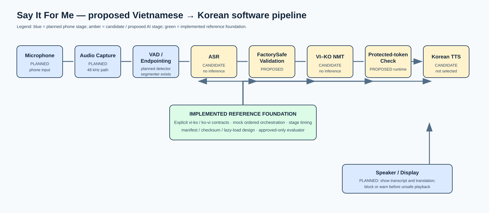
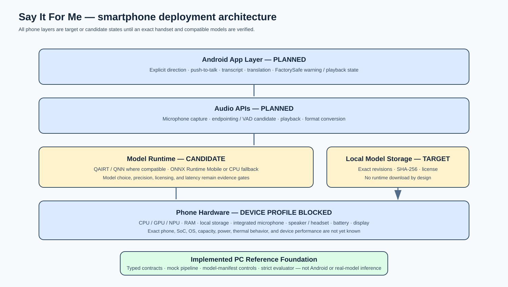

# TECHNICAL PROPOSAL

## Phase 2 — Technical Submission

| Team / Project Name | Say It For Me |
| :--- | :--- |
| Submission Date | 21/08/2026 |
| Version | v1.0 — final evidence-backed submission |
| Confidentiality | Restricted — Challenge Review Only |

### Evidence and wording policy

This working submission intentionally separates project facts from design intent. `CONFIRMED` is supported by the context log or repository; `MEASURED` has reproducible raw evidence; `TARGET` is an unmeasured engineering objective; `PROPOSED` is a design choice awaiting team confirmation or implementation; and `BLOCKED` requires human input. `DRAFTED` means prose/tables exist but still need the stated evidence or input. `IMPLEMENTED` is limited to the cited Python reference behavior; `CANDIDATE` is an unselected option; `HYPOTHESIS` needs validation; and `MIXED` identifies a section containing more than one state. Candidate model names do not mean a model has been selected or run. No mock timing, non-approved evaluation fixture, PC result, or platform capability statement is presented as a phone result.

### Evaluation Criteria & Scoring Rubric

| Criterion | Weight | Proposal Response |
| :--- | ---: | :--- |
| AI Approach & Technical Design | 35% | Section 4: state-labelled pipeline, candidates, targets, evidence gates, optimisation, and robustness. |
| Hardware & Device Concept | 25% | Section 5: smartphone-first comparison, BOM, and measurement-led power reasoning. |
| Business Solution | 15% | Section 3: current alternatives, validation gaps, and FactorySafe Translation Guard. |
| Problem Definition & Impact | 15% | Section 2: initial problem hypothesis, target users, constraints, and research plan. |
| Team and Execution Plan | 10% | Section 7: recovery plan and human-input gate for verified team profiles. |

## 1. Executive Summary

**Status: FINAL — IMPLEMENTED foundation and PROPOSED mobile design; no unsupported AI performance claim.**

Say It For Me addresses an initial problem hypothesis for Vietnamese operators and Korean supervisors or engineers who exchange short safety, maintenance, quality, and production instructions on a factory floor. In this setting, gestures and bilingual colleagues can slow a task, while cloud translation may be unsuitable where connectivity is weak, audio must remain local, or numbers, units, machine codes, and part identifiers must be preserved. The team has not yet completed factory interviews or quantified operational impact; those findings are a validation workstream, not evidence in this proposal.

The proposed solution is a smartphone-based, offline-first Vietnamese–Korean voice-translation application. A user explicitly selects the direction, uses push-to-talk, sees the transcript and translation, and receives target-language audio only after validation. The device concept deliberately uses existing smartphone hardware—microphone, speaker or headset, battery, display, storage, and SoC—rather than a custom enclosure. The exact phone, operating system, and SoC are not yet confirmed, so no phone performance or battery-life result is claimed.

Its proposed differentiator is the **FactorySafe Translation Guard**: a validation layer designed to preserve numbers, units, machine codes, and part IDs; use reviewed phrases where available; show text before audio; and request repetition rather than play a result that fails a safety check. The repository already contains explicit-direction contracts, a bounded VAD-oriented segmenter, a mock pipeline, model-manifest safeguards, an evaluation framework, real ASR/NMT adapters, and a strict file-demo entry point. Korean TTS, a successful real-audio run, offline verification, and mobile integration remain unimplemented or unmeasured. The Phase 2 engineering target is sub-three-second post-utterance first translated audio, to be measured separately on PC and on the selected phone.

### 1.1 Problem Overview

**Status: CONFIRMED use case; PROPOSED problem framing; BLOCKED on user validation.**

Vietnamese operators, technicians, Korean supervisors, and Korean engineers may need to exchange brief instructions while operating machinery, checking quality, reporting faults, or handling safety procedures. The selected use case assumes a noisy, hands-busy environment in which a long typing workflow is impractical and cloud processing may be undesirable. Current project evidence does not quantify accidents, downtime, cost, or the prevalence of this need. This is therefore an **initial problem hypothesis based on the selected industrial use case**; Member 1 must validate it through interviews or credible sector sources before the final submission.

### 1.2 Proposed Solution

**Status: PROPOSED.**

Say It For Me is a proposed offline-first, explicit-direction Vietnamese–Korean voice-translation application for a smartphone. It combines push-to-talk audio interaction, local model storage, visible text, target-language speech, and a FactorySafe Translation Guard intended to prevent unsafe playback when protected tokens or validation checks fail.

### 1.3 Key Value Proposition

**Status: PROPOSED and TARGET; no item below is a measured product outcome.**

| Capability | Safe current wording |
| :--- | :--- |
| Offline-first operation | The target architecture keeps required language-pack assets on the phone and is designed to avoid runtime cloud calls after provisioning; a network-disabled test is still required. |
| FactorySafe Translation Guard | Proposed validation preserves and checks numbers, units, machine codes, and part IDs before Korean TTS playback. |
| Direction-explicit workflow | The repository **implements** explicit `vi-ko` and `ko-vi` request contracts; automatic language detection is not in the critical path. |
| Traceable engineering | The repository **implements** per-stage timing records, deterministic errors, manifest checks, and an approved-only evaluation gate. These are not real-model quality or latency results. |

## 2. Problem Definition & Target Users

**Scoring weight: 15% — Problem Definition & Impact**

### 2.1 Problem Statement

**Status: PROPOSED hypothesis; BLOCKED on interviews/source validation.**

The project addresses short, time-sensitive Vietnamese–Korean exchanges related to operations, quality, maintenance, and safety. A translation system for this use case must account for acoustic noise, short interaction windows, explicit language direction, privacy constraints, and the risk of altering technical tokens. It is not proposed as a replacement for certified interpreters or formal safety procedures. The intended role is to reduce friction in routine communication and to surface uncertainty rather than silently produce an untrusted spoken result.

### 2.2 Impact Analysis

**Status: HYPOTHESIS — no numerical safety, downtime, productivity, or cost claims have been validated.**

| Impact Area | Current Pain Point | Consequence |
| :--- | :--- | :--- |
| Safety / operations | Hypothesis: a spoken stop, warning, value, or machine code can be misunderstood across languages. | Potential delayed clarification or unsafe action if established procedures are not followed. |
| Productivity | Hypothesis: a worker may need to wait for a bilingual colleague or repeat an explanation. | Potential slower troubleshooting, handover, or training. |
| Quality | Numbers, units, error codes, and part IDs can be lost in generic translation. | Potential incorrect adjustment or additional inspection. |
| Connectivity / privacy | A cloud-dependent workflow may not meet site connectivity or data-policy needs. | The translation workflow may be unavailable or unsuitable. |

Validation required: Member 1 must confirm workflow and safety impact with factory interviews or a credible source, and Member 2 must confirm site connectivity and device-policy constraints.

### 2.3 Target Users & Use Cases

**Status: PROPOSED priority ranking; validate with target users.**

| User Segment | Language Need | Primary Context | Priority |
| :--- | :--- | :--- | :--- |
| Vietnamese operator | Korean → Vietnamese | Short operating, quality, or safety instruction | Critical |
| Korean supervisor / engineer | Vietnamese → Korean and Korean → Vietnamese | Production oversight and troubleshooting | Critical |
| Vietnamese technician | Vietnamese → Korean | Fault, measurement, or maintenance report | High |
| Trainer / shift lead | Bidirectional | Training and standard-work handover | High |

### 2.4 Key Design Constraints

**Status: Mix of CONFIRMED project decisions and TARGET requirements.**

| Constraint | Target / Requirement | Classification |
| :--- | :--- | :--- |
| Internet dependency | Runtime is designed to use only locally provisioned assets; verify with a network-disabled test. | PROPOSED |
| End-to-end translation latency | Target: under 3 seconds from end of speech to first translated audio for a short utterance. | TARGET — not measured |
| Target deployment environment | Smartphone used for industrial-floor communication; exact site conditions are unverified. | CONFIRMED phone form factor; PROPOSED environment profile |
| Language pair | Product intent: Vietnamese ↔ Korean. Phase 2 real-pipeline scope: Vietnamese → Korean first; Korean → Vietnamese opens only after separately selected ASR/NMT/Vietnamese-TTS candidates pass evidence gates. | CONFIRMED product intent; TARGET staged scope |
| Interaction | Push-to-talk and an always visible selected direction. | CONFIRMED direction; PROPOSED mobile UX |
| Privacy | Do not persist raw audio by default; retain only approved local diagnostics when enabled. | PROPOSED — needs implementation and policy confirmation |
| Safety behavior | Show transcript/translation and request repetition when a validation check fails. | PROPOSED |
| Hardware limit | Exact RAM, storage, battery, OS, and thermal limits depend on the selected phone. | BLOCKED — Member 2 input required by 12/08/2026 |

## 3. Business Solution & Innovation

**Scoring weight: 15% — Business Solution**

### 3.1 Industry Problem & Solution Fit

**Status: PROPOSED positioning; BLOCKED on target-user and competitor validation.**

Say It For Me is proposed for frequent, short factory interactions—not for legal, emergency, or high-risk communication that requires a certified interpreter or established site procedure. The business hypothesis is that a site-controlled phone workflow can complement rather than replace human support.

| Existing approach | Potential strength | Use-case gap to validate | Proposed response |
| :--- | :--- | :--- | :--- |
| Cloud translation application | Broad language coverage and familiar consumer UX. | Network availability, data handling, latency variability, and protection of technical tokens may not fit a factory workflow. | Local language packs, explicit direction, visible text, and FactorySafe checks. |
| Bilingual colleague or interpreter | Human contextual judgment. | May not be immediately available at every short interaction; not a scalable default for routine exchanges. | Use phone translation for low-risk routine exchanges and escalate uncertainty. |
| Phrasebook / static translation | Reviewed wording can be highly reliable for known phrases. | Does not cover free-form fault reports or new content. | Use a reviewed phrasebook as a guarded fallback alongside translation. |
| Commercial translation device | Purpose-built translation interaction. | Factory vocabulary, validation policy, and local deployment requirements may be insufficiently transparent. | Evaluate only after sources and device-specific evidence are collected. |

Member 1 must replace the validation language above with cited findings from interviews, current products, or official documents. Until then, the comparison is a hypothesis, not a measured market claim.

### 3.2 Innovation & Competitive Strengths

**Status: PROPOSED — FactorySafe Translation Guard is not implemented or measured.**

| Dimension | Existing Solutions | Say It For Me Proposal |
| :--- | :--- | :--- |
| Connectivity | Cloud or consumer offline behavior varies by vendor, device, and installed language pack. | A local-only runtime is the design objective after provisioning; offline behavior must be tested. |
| Latency | Do not assume a universal cloud latency; it varies by network and product. | Under-three-second post-utterance first-audio target; no measured latency yet. |
| Domain control | Generic translation may not explicitly validate codes, values, or units. | Proposed protected-token extraction, glossary, reviewed phrasebook, and pre-playback validation. |
| Privacy | Vendor data paths and retention policies vary. | Proposed local processing and no raw-audio persistence by default; needs implementation and policy test. |
| Failure handling | Output behavior depends on the product. | Proposed block/warn/repeat behavior for empty input, direction mismatch, missing protected tokens, or failed validation. |

**FactorySafe Translation Guard** is the proposed innovation thesis. It treats numerical values, units, machine codes, error codes, and part IDs as protected tokens; checks their presence before playback; supports reviewed phrases for recurring safety language; shows source and translated text; and requests a repeat rather than speaking a result that fails validation. It is a safety-oriented design layer, not a claim that translation is safe or correct. Its future evidence should include protected-token preservation, block-rate analysis, reviewed phrase coverage, and human Korean review.

## 4. AI Approach & Technical Design

**Scoring weight: 35% — highest-weighted criterion**

### 4.1 System Pipeline Overview

**Status: MIXED — explicit-direction contracts, real ASR/NMT adapter code, and a strict VI→KO demo CLI are IMPLEMENTED; no successful real-audio inference is MEASURED.**

The desired Phase 2 Vietnamese → Korean path is: microphone → audio capture → **VAD detector / endpointing (planned)** → ASR → FactorySafe pre-translation validation → Vietnamese–Korean NMT → FactorySafe post-translation protected-token check → Korean TTS → speaker and display. Before NMT, the proposed guard rejects empty text, validates the selected direction, and extracts protected tokens. After NMT, it compares required tokens with the translated output and applies a block/warn/repeat policy before any TTS request. A reviewed phrasebook may be offered only for an explicitly matched reviewed phrase. These guard rules are proposed, not implemented.

The original Python reference slice accepts a 48 kHz `AudioBuffer`, invokes a passthrough mock denoiser, resamples to 16 kHz, applies scripted mock ASR, dictionary mock translation, and a 440 Hz tone synthesizer. Separately, `WhisperRecognizer` uses faster-whisper/CTranslate2 and `NllbTranslator`/`M2M100Translator` use Transformers/PyTorch with explicit language codes; these are real inference adapters, not mock fallbacks. `demo_cli` reads only a supplied mono 16 kHz PCM-16 WAV and writes transcript, translation, and run metadata only after successful real inference. Its 21/08/2026 run recorded a missing-input failure before model loading because no consented Vietnamese WAV was available. The repository therefore does **not** yet demonstrate ASR/NMT output, Korean TTS, FactorySafe runtime enforcement, offline execution, or phone operation.

**Direct repository evidence snapshot:** `PYTHONPATH=src python -m unittest discover -s tests -v` passed 39 tests with 3 intentional inference-smoke skips on 21/08/2026. The test gate supports contracts, adapter boundary handling, and the strict WAV loader; it is not ASR/NMT quality, latency, offline, TTS, or phone evidence. The reproducible missing-input artifact is in [`evidence/demo/run.json`](evidence/demo/run.json).

### 4.2 Module-by-Module Design

**Status: Candidates and targets only unless marked IMPLEMENTED. Exact model revision, license, runtime, precision, and artifact size remain evidence gates.**

| Module | Model / Framework | Size | Latency Target | Key Technique / Current State |
| :--- | :--- | :--- | :--- | :--- |
| Audio capture / endpointing | Android audio API plus VAD candidate | Model selection deferred to Phase 3 | Endpointing uses a 400 ms silence design setting | VAD-oriented 20 ms segmentation, 200 ms pre-roll, and 8 s maximum are implemented; a VAD detector and phone capture are not. |
| Noise handling | Bypass baseline; denoiser candidate later | No model selected | Included only if evidence supports it | Do not assume noise suppression helps; compare on/off with identical noisy clips. |
| ASR | **IMPLEMENTED adapter:** Whisper Tiny/Base via faster-whisper/CTranslate2; Tiny is provisional demo baseline | Candidate artifacts not provisioned in this run | Target allocation: ≤900 ms p50 | Adapter enforces 16 kHz mono input and explicit VI/KO code. No real Vietnamese WAV, transcript, quality, or latency result exists. |
| FactorySafe validation | Deterministic rules plus reviewed phrasebook | Small local rules/data; Phase 3 selection | Target allocation: ≤100 ms p50 | Proposed token extraction, validation, and warn/block policy. |
| VI–KO NMT | **IMPLEMENTED adapters:** NLLB-200 distilled 600M and M2M100-418M via Transformers/PyTorch | Candidate artifacts not provisioned in this run | Target allocation: ≤900 ms p50 | NLLB uses `vie_Latn`→`kor_Hang`; M2M100 uses `vi`→`ko`. M2M100 is the provisional MIT-license demo baseline; this is risk management, not a quality selection. |
| Protected-token check | Existing evaluator metric; pipeline integration proposed | Small local rules/data; Phase 3 selection | Included with validation | The metric exists; runtime enforcement does not. |
| Korean TTS | Phase 3 candidate selection pending | Not selected | Target first audio: ≤500 ms p50 | Must record exact checkpoint, license, runtime, and Korean listener review. |
| Vietnamese TTS for KO–VI | Phase 3 candidate selection pending | Not selected | No Phase 2 target until Vietnamese → Korean evidence is complete | Required before any Korean → Vietnamese spoken-output claim. |
| Speaker / display | Android audio output and UI | Device supplied | Target: show text before any guarded playback | Planned phone integration. |

The numerical allocations are an engineering budget for the under-three-second target, not benchmark results: ASR (900 ms) + guard (100 ms) + NMT (900 ms) + Korean TTS first audio (500 ms) = 2,400 ms. The remaining 600 ms is reserved for post-endpoint audio handoff, bounded-queue/orchestration, data conversion, text/UI update, and audio-output initiation. The 400 ms endpointing rule is excluded because the measure begins at end of speech; the measurement protocol must state this boundary explicitly.

### 4.3 On-Device Optimisation & Memory Management

**Status: Partly CONFIRMED architecture; TARGET mobile design.**

The repository already provides a local manifest model, SHA-256 verification, artifact-root path protection, lazy model loading, explicit runtime/precision/license metadata fields, and a default of one heavy inference request. ADR-002 also sets a bounded finalized-segment queue of two and preserves input order. These are useful design controls, not a phone memory measurement.

The proposed mobile path is to package only required local language assets, load small audio components first, lazy-load heavy models, warm them once, retain only the selected target-language TTS voice, reuse model sessions, use fixed-size PCM16 or float32 buffers rather than Python tuples, and measure cold/warm load, peak resident memory, model artifact size, and thermal throttling separately. The RAM ceiling, quantisation format, runtime choice, and unload policy cannot be finalized until Member 2 supplies the exact phone profile and candidate models pass the ADR-003 evidence gate.

### 4.4 Robustness & Edge Case Handling

**Status: MIXED — explicit direction, ASR 16 kHz rejection, NMT same-language rejection, and missing-input failure recording are implemented; real speech/model outcomes and all quality claims remain blocked.**

| Challenge | Current or Proposed Handling | Evidence State |
| :--- | :--- | :--- |
| Factory noise | Start with a bypass baseline; retain a denoiser only if matched noisy-clip evaluation improves ASR enough to justify added latency. | PROPOSED; no noisy-ASR result |
| Silence / stopped speech | Do not invoke NMT/TTS when no speech is detected; ask the user to repeat. | PROPOSED detector; segmenter exists but receives external speech labels |
| Long or rapid speech | 20 ms frames, 200 ms pre-roll, 400 ms silence endpoint, and 8 s maximum segment. | CONFIRMED segmenter configuration; no real speech test |
| Direction error | Direction is explicit in the request; the reference pipeline rejects transcript or translation language output that conflicts with that selected direction. | IMPLEMENTED contract test coverage |
| Multiple speakers / echo | Push-to-talk half-duplex workflow and a one-speaker prompt; headset is a possible field option. | PROPOSED; field validation required |
| Accents, dialects, code switching | Log failures; do not auto-reverse direction; evaluate only after reviewed audio is available. | PROPOSED |
| Protected token failure | Warn/block playback and request repetition when tokens are absent or validation fails. | PROPOSED; evaluator metric exists |
| TTS failure | Keep visible translated text and return a stable error; do not fabricate spoken output. | PROPOSED |
| Missing WAV / unsupported format | `demo_cli` rejects absent, non-mono, non-16 kHz, compressed, empty, or non-PCM-16 inputs before model loading and records a structured failure in `run.json`. | IMPLEMENTED boundary behavior; no real-audio inference result |

## 5. Hardware & Device Concept

**Scoring weight: 25% — smartphone is the CONFIRMED product form factor. No phone model has been confirmed.**

### 5.1 Platform Selection & Justification

**Status: PROPOSED platform class selection — not benchmarked by the team.**

| Criteria | Option A — Snapdragon 8 Gen 3 Android phone class | Option B — Snapdragon 7+ Gen 3 Android phone class | Selected? |
| :--- | :--- | :--- | :--- |
| AI-related capability | Qualcomm documents a Hexagon NPU/AI Engine and support for INT4, INT8, INT16 and FP16 (SKU dependent). | Qualcomm documents a Hexagon NPU/AI Engine and support for INT4, INT8, INT16 and FP16. | **PROPOSED: Option A** |
| NPU performance | No project-specific benchmark; end-to-end translation speed must be measured on the selected handset. | No project-specific benchmark; end-to-end translation speed must be measured on the selected handset. | No benchmark claim |
| Power consumption | Handset battery, display state, thermals, runtime and workload determine the result. | Same limitation. | No power claim |
| RAM / storage | OEM-specific; select a handset only after its officially published RAM/storage configuration is reviewed. | Same requirement. | OEM specification gate |
| AI SDK / toolchain | Proposed Android path: Qualcomm AI Runtime (QNN/QAIRT) where model-compatible, then CPU/ONNX Runtime Mobile fallback. | Same proposed route. | Compatibility test required |
| Form factor suitability | Premium Android smartphone class with integrated display, microphones, speaker/headset path, battery and local storage. | High-tier Android smartphone class with the same integrated components. | Option A is the preferred Phase 3 evaluation class |

Qualcomm’s public Snapdragon 8 Gen 3 and 7+ Gen 3 material supports these as **candidate SoC classes**, not as selected phones or measured devices. Qualcomm AI Hub documents a workflow to optimise, validate, profile and deploy models on-device, including runtime, load-time and peak-memory measurements. The proposed Phase 3 evaluation class is a Snapdragon 8 Gen 3 Android phone because it is Qualcomm’s premium class and exposes the documented Hexagon NPU/AI Engine; a Snapdragon 7+ Gen 3 handset remains the cost-tier comparison class. This is a platform decision only: no handset, RAM, battery, TDP, TOPS, thermals, or translation performance is asserted.

Sources for platform capability: [Qualcomm Snapdragon 8 Gen 3](https://www.qualcomm.com/smartphones/products/8-series/snapdragon-8-gen-3-mobile-platform), [Qualcomm Snapdragon 7+ Gen 3](https://www.qualcomm.com/smartphones/products/7-series/snapdragon-7-plus-gen-3-mobile-platform), and [Qualcomm AI Hub documentation](https://app.aihub.qualcomm.com/docs/index.html). Device-specific specifications must come from the selected OEM handset’s official page or the physical device, not these platform pages.

### 5.2 Key Hardware Components & Power Budget

**Status: PROPOSED smartphone BOM; exact electrical values require a selected handset.**

| Component | Specification | Peak Power | Notes |
| :--- | :--- | :--- | :--- |
| Smartphone / SoC | Proposed Snapdragon 8 Gen 3 Android class; exact handset intentionally unselected. | Not publicly specified as a project value; measure on handset. | Primary compute, display, connectivity-control and enclosure platform. |
| Integrated microphone | OEM microphone path; verify mono capture behavior and permission/API access. | Measured with the selected handset only. | No custom MEMS array is proposed. |
| Speaker / headset | Integrated speaker; wired or Bluetooth headset only if site policy and tests support it. | Measured with the selected handset only. | Text remains visible for guarded or failed TTS. |
| Battery | Integrated OEM battery; capacity/health come from the selected handset. | Not applicable as a component peak-power row. | No runtime claim without duty-cycle measurements. |
| Local storage | OEM internal storage; reserve capacity after exact model artifacts are selected. | Measured with the selected handset only. | Stores application and local model assets; raw audio is not retained by default. |
| Display / touch | Integrated phone display and touch screen. | Measured with the selected handset only. | Shows selected direction, transcript, translation, warning and playback state. |
| Total system budget | No numerical budget asserted. | Active, idle and thermal scenarios are a Phase 3 measurement protocol. | Report phone, OS, brightness, network state, temperature, models and run protocol. |

Power-budget reasoning is deliberately measurement-led. For a test window, average translation power should be calculated as baseline phone power plus the time-weighted capture, ASR, NMT, TTS, display, and audio-output loads. Battery-life estimate should then use measured usable battery energy divided by this measured average power, with a stated safety margin for thermal throttling and battery health. Capture-only, model-load, first-audio, repeated-request, and idle states must be logged separately. Until those inputs exist, no TDP, wattage, battery-life, or thermal result is claimed.

## 6. System Architecture & Integration

### 6.1 Software Stack

**Status: Existing Python reference components and PC-only real-adapter code are IMPLEMENTED; Android/mobile components are PROPOSED.**

| Layer | Component / Framework | Role |
| :--- | :--- | :--- |
| OS | **PROPOSED:** Android; exact OS version will be recorded with the selected handset. | Phone runtime and permissions. |
| App layer | **PROPOSED:** Native Android application, likely Kotlin with native interop only where needed. | Direction selection, push-to-talk, transcript, warning, playback state. |
| Audio processing | **PROPOSED:** Android audio APIs plus a VAD candidate; optional denoise candidate only after evaluation. | Capture, endpointing, playback, and format conversion. |
| AI runtime | **CANDIDATE:** QAIRT/QNN if model/device compatible; ONNX Runtime Mobile or CPU fallback evaluated per model. | On-device inference execution. |
| Model serving | **CONFIRMED Python foundation; PROPOSED phone port:** local model pack with exact revisions, checksums, runtime, precision, and license metadata. | Provisioning, validation, lazy loading, and version control. |
| PC demo harness | **IMPLEMENTED, not yet successful:** typed contracts, mock stages, evaluator, model-store logic, real ASR/NMT adapters, and `demo_cli`. | The CLI has no mock fallback and recorded a missing-input failure; it is not mobile, real-audio, or model-performance evidence. |

### 6.2 Architecture Diagrams

**Status: PROPOSED deployment architecture, with implemented versus planned layers labelled.**

### 6.3 Offline-First Design Principles

**Status: PROPOSED architecture; no offline runtime test has been completed.**

1. Provision exact local model files before use; prevent automatic runtime downloads.
2. Validate local paths and checksums before model load; stop with a clear error if a required asset is unavailable.
3. Keep direction selection explicit and keep source/translated text visible in the user interface.
4. Store raw audio only with explicit test-mode consent; default to no raw-audio persistence.
5. Make FactorySafe validation a gate before target-language playback, with a repeat/warning path rather than unsafe audio.
6. Record only the diagnostic information approved by the team’s privacy policy; do not claim privacy compliance before policy and implementation review.
7. Validate this design with a real network-disabled run and retain raw command output, device profile, and model versions as evidence.

## 7. Team Profile & Project Timeline

**Scoring weight: 10% — verified roles, responsibilities, and execution ownership.**

### 7.1 Team Members

| Name | Role | Expertise | Contribution Area |
| :--- | :--- | :--- | :--- |
| **Nguyễn Đổng Thiên Kỳ** | Technical Lead | Technical leadership, integration and release control. | Technical decisions, integration, scope control, claim consistency and final submission approval. |
| **Nguyễn Tiến Đạt** | ASR & Translation Engineer (ATE) | Confirmed ownership: ASR, VI→KO NMT, model selection/evaluation, technical evidence. | Section 4 ASR/NMT evidence and technical input. |
| **Nguyễn Đăng Gia Đạo** | Audio, TTS & Device Engineer (AUD) | Confirmed ownership: WAV/audio, Korean TTS, microphone/playback, phone/hardware evidence. | Sections 4–6 audio, hardware, and device evidence. |
| **Hà Duy Lộc** | Dataset, Application & Submission Engineer (APP) | Confirmed ownership: dataset/evaluator, Korean review coordination, app/demo, proposal package, submission requirements. | Sections 2, 3, 7, and 8; proposal controls and submission package. |

### 7.2 Project Timeline

**Status: Actual Phase 2 execution through submission closeout; Phase 3 items are prospective.**

| Phase | Milestone | Key Activities | Target Date |
| :--- | :--- | :--- | :--- |
| 1 | Requirements and architecture foundation | Define explicit direction contracts, evaluation controls, model lifecycle and the proposal evidence vocabulary. | Completed before Phase 2 closeout |
| 2 | Proposal/evaluator foundation | Build the typed pipeline, mock reference stages, dataset schema, evaluator and diagrams. | Completed before Phase 2 closeout |
| 3 | Real ASR/NMT integration | Add Whisper/faster-whisper and M2M100/NLLB adapter implementations, strict WAV demo CLI and tests. | Completed 21/08/2026 |
| 4 | Phase 2 submission | Finalise evidence-labelled proposal content, diagrams, records and release checks. | 21/08/2026 |
| 5 | Phase 3 validation | Select handset and TTS candidate; collect permitted audio; measure local inference, memory, thermals and offline operation; add FactorySafe runtime enforcement. | Future work |

## 8. Submission Checklist

| # | Checklist Item | Working Status |
| :--- | :--- | :--- |
| 1 | Executive Summary written at 200–300 words | COMPLETE — evidence-labelled and qualitative. |
| 2 | Problem statement, target users, and constraints completed | COMPLETE — qualitative claims only; field validation is Phase 3. |
| 3 | Business solution completed with industry gap and differentiation | COMPLETE — no unsupported competitor or accuracy comparison. |
| 4 | AI pipeline documented with models, latency targets, and optimization strategy | COMPLETE — implementation, proposed stages and limitations are separated. |
| 5 | Hardware platform, smartphone BOM, and power reasoning completed | COMPLETE — proposed SoC class with no fabricated handset measurements. |
| 6 | Team profiles and timeline filled | COMPLETE — verified team roster and actual Phase 2/Phase 3 milestones. |
| 7 | Placeholder text removed; diagrams inserted | COMPLETE — software pipeline and smartphone deployment diagrams included. |
| 8 | Demo/prototype link attached and PDF exported | LIMITATION — a strict demo CLI exists; its measured artifact is an input-validation failure. PDF export requires access to the official Google Doc master. |

## Source and Evidence Notes

- Project state and technical evidence boundaries: [context log](https://docs.google.com/document/d/1cG663jvRsRXzXKcSi--YQF96w1e0rfAevKNiMZuDyJo/edit?tab=t.0), [`README.md`](../../README.md), [`evidence_register.md`](../evidence_register.md), and ADR-001 through ADR-003.
- Current repository verification: `PYTHONPATH=src python -m unittest discover -s tests -v` on 21/08/2026 passed 39 tests with 3 intentional optional-inference skips. [`evidence/demo/README.md`](evidence/demo/README.md) and [`run.json`](evidence/demo/run.json) record the exact pending input and failure behavior. These artifacts do not support ASR/NMT quality, latency, offline operation, TTS, or phone-deployment claims.
- The claim-level wording and open evidence gaps are maintained in [CLAIM_EVIDENCE_MAP.md](CLAIM_EVIDENCE_MAP.md). Proposal completeness ownership is maintained in [PROPOSAL_COMPLETION_MATRIX.md](PROPOSAL_COMPLETION_MATRIX.md).
