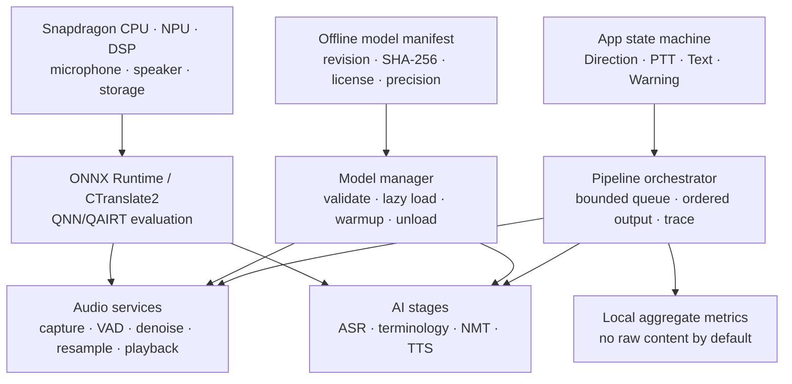

# TECHNICAL PROPOSAL — Phase 2 Working Draft

| Field | Value |
|---|---|
| Team / Project Name | **[TEAM NAME TBC] / Say It For Me** |
| Submission Date | **21/08/2026 official deadline; internal target 20/08/2026** |
| Version | v0.3 working draft — 27/07/2026 |
| Confidentiality | Restricted — Challenge Review Only |

> **Draft policy:** `Measured` means a linked reproducible result exists. `Target` is an engineering objective. `Estimate` is a calculation awaiting device measurement. This draft contains no measured AI performance result yet.

## 1. Executive Summary

Vietnamese operators and Korean supervisors in FDI manufacturing plants routinely exchange short safety, quality, maintenance, and production instructions in noisy, hands-busy environments. Gestures, bilingual intermediaries, and cloud-first translation tools do not provide a dependable factory workflow when connectivity is restricted, audio cannot leave the site, or technical terms and machine identifiers must be preserved.

**Say It For Me** is a portable, offline Vietnamese ↔ Korean voice translation assistant designed around an explicit push-to-talk interaction. The user selects `VI → KO` or `KO → VI`; the device captures and segments speech, suppresses factory noise, transcribes in the known source language, translates with terminology protection, synthesizes the target language, and plays the result locally. No runtime cloud call is required after a language pack is provisioned.

Our technical differentiator is an evidence-driven Edge AI pipeline rather than an unsupported end-to-end latency claim. Audio is processed in VAD-aligned bounded segments; model queues and in-flight inference are capped to control memory; each stage records p50/p95 latency and resource use; and every model must pass accuracy, license, artifact, and peak-memory gates. The first product target is p50 below three seconds from end-of-speech to first translated audio for utterances up to five seconds, to be validated first on PC and then on the selected Snapdragon platform.

Phase 3 targets a rugged handheld/lanyard prototype on Qualcomm QCS6490/RB3 Gen 2-class hardware, with QCS8550 retained as a performance fallback. This architecture combines offline privacy, factory-noise resilience, manufacturing terminology controls, and a credible migration path through Qualcomm AI Hub and QNN/QAIRT.

### 1.1 Problem Overview

The communication gap affects Vietnamese operators, technicians, shift leads, and Korean supervisors/engineers. Misunderstood speech can cause rework, downtime, delayed maintenance, and safety risk. A viable solution must remain usable in factory noise, with minimal touch interaction, no mandatory internet, and no audio sent to an external service.

### 1.2 Proposed Solution

Say It For Me is an offline, direction-explicit Edge AI speech pipeline for a portable Snapdragon device, specialized for short Vietnamese ↔ Korean manufacturing interactions and instrumented for measurable latency, accuracy, memory, and stability.

### 1.3 Key Value Proposition

- **Offline by construction:** local models and a checksum-validated manifest; no runtime API dependency.
- **Factory-oriented audio:** 48 kHz denoising candidate, VAD endpointing, and evaluation at 15/10/5/0 dB SNR.
- **Deterministic bilingual UX:** explicit direction eliminates language-routing failures and unnecessary detection work.
- **Auditable performance:** stage traces, p50/p95, peak RSS, model revisions, and failure cases accompany every result.
- **Terminology safety:** protected numbers, units, machine IDs, error codes, and a reviewer-validated manufacturing glossary.

## 2. Problem Definition & Target Users

### 2.1 Problem Statement

Manufacturing communication is dominated by short, time-sensitive utterances such as “stop line two,” “check the pressure,” “replace this mold,” or “the quality check failed.” Noise, accents, protective equipment, and limited interaction time degrade speech recognition. Cloud dependence conflicts with restricted networks and data policies. General translation also risks changing numbers, units, part codes, and specialized verbs. The problem is therefore not only translation quality; it is reliable end-to-end operation under acoustic, privacy, usability, and resource constraints.

### 2.2 Impact Analysis

| Impact Area | Current Pain Point | Consequence |
|---|---|---|
| Safety / Operations | Verbal stop, lockout, or hazard instructions may be misunderstood | Delayed response, unsafe action, escalation to a translator |
| Productivity | Staff wait for a bilingual colleague or re-explain with gestures | Downtime, rework, slower troubleshooting |
| Quality | Numbers, tolerances, defect names, and process steps are mistranslated | Incorrect adjustment, rejected output, repeated inspection |
| Connectivity / Privacy | Cloud speech tools may be unavailable or disallowed | Workflow fails or sensitive audio leaves the site |
| Training | Foreign experts cannot explain procedures fluently to local staff | Slower knowledge transfer and onboarding |

### 2.3 Target Users & Use Cases

| User Segment | Language Need | Primary Context | Priority |
|---|---|---|---|
| Vietnamese operators | KO → VI | Receive operations, safety, and quality instructions | Critical |
| Korean supervisors/engineers | VI → KO and KO → VI | Direct production and troubleshoot equipment | Critical |
| Vietnamese technicians | VI → KO | Report faults, measurements, and maintenance needs | High |
| Trainers / shift leads | Bidirectional | Standard work, handover, and skills transfer | High |

### 2.4 Key Design Constraints

| Constraint | Target / Requirement |
|---|---|
| Internet dependency | Zero at runtime after offline provisioning |
| Latency | **Target:** p50 `< 3.0 s`, p95 `< 5.0 s` from speech end to first translated audio for utterances ≤ 5 s |
| Acoustic environment | Evaluate clean plus synthetic factory noise at 15/10/5/0 dB SNR |
| Language pair | Vietnamese ↔ Korean only in the first prototype |
| Interaction | Push-to-talk; explicit direction; gloves/hands-busy compatible |
| Privacy | Raw audio not persisted by default |
| Memory | Bounded queues; one heavy inference request by default; device ceiling set by profiling |
| Safety | “Please repeat” behavior for silence/unstable output; visible transcript for critical phrases |

## 3. Business Solution & Innovation

### 3.1 Industry Problem & Solution Fit

Cloud-first consumer translators are optimized for broad individual use, not auditable deployment in a restricted factory. Their connectivity, data path, terminology behavior, and latency vary with device and network. Human interpreters provide high value but cannot be present at every machine interaction and introduce scheduling cost and delay.

Say It For Me occupies the gap between these approaches: a site-controlled offline device for frequent short interactions, with measured noise behavior and factory terminology controls. It does not replace certified interpreters for legal or high-risk decisions; it reduces the everyday communication burden and escalates uncertain output.

### 3.2 Innovation & Competitive Strengths

| Dimension | Common alternative | Say It For Me |
|---|---|---|
| Connectivity | Cloud path or feature-dependent offline mode | Fully local runtime after provisioning |
| Latency evidence | User-perceived result varies with network/device | Per-stage and end-to-end p50/p95 on named hardware |
| Domain accuracy | Generic vocabulary | Protected tokens, glossary, manufacturing test set |
| Noise | Generic microphone preprocessing | Denoiser on/off evaluation at controlled SNR |
| Data privacy | External processing may be required | Audio/text remain local by default |
| Failure handling | Opaque output | Explicit direction, trace IDs, repeat warning, text confirmation |
| Deployability | Consumer app lifecycle | Model manifest, checksums, license inventory, Snapdragon migration plan |

The novelty is the integration of a deterministic bilingual UX with resource-bounded inference and manufacturing-specific evaluation. The system treats model choice as an evidence gate: a smaller model is not accepted merely because it is small, and a high-quality research model is not accepted if its license blocks the intended deployment.

## 4. AI Approach & Technical Design

### 4.1 System Pipeline Overview

```mermaid
flowchart LR
    A["Direction + Push-to-talk"] --> B["48 kHz capture<br/>20 ms frames"]
    B --> C["Ring buffer + VAD<br/>bounded segment"]
    C --> D["Noise suppression<br/>48 kHz"]
    D --> E["Resample<br/>16 kHz ASR"]
    E --> F["ASR<br/>fixed source language"]
    F --> G["Normalize + protect<br/>numbers/units/IDs"]
    G --> H["VI ↔ KO NMT"]
    H --> I["Target-language TTS"]
    I --> J["Playback + text<br/>trace + warning"]
```

DeepFilterNet is evaluated at its required 48 kHz boundary. Speech recognition receives a separate 16 kHz buffer. VAD aligns segments to speech/silence rather than cutting blindly at fixed times. The finalized-segment queue is capped at two, and the default permits one heavy inference request at a time. Capture may continue while the previous segment is processed, but outputs are committed in order.

### 4.2 Module-by-Module Design

| Module | Candidate / Framework | Artifact size | Initial latency budget | Key technique |
|---|---|---:|---:|---|
| Capture / VAD | Silero VAD; WebRTC VAD fallback | To measure | Endpoint budget 400 ms | 20 ms frames, 200 ms pre-roll, 8 s maximum |
| Noise suppression | DeepFilterNet3; RNNoise/bypass baseline | To measure | 200 ms per finalized utterance | 48 kHz, evaluate ASR impact by SNR |
| ASR | Whisper Tiny vs Base multilingual | To measure | p50 900 ms | Fixed source language, quantized candidate, vi/ko CER/WER gate |
| Text controls | Deterministic normalization/glossary | Small local data | Included with NMT | Protect numbers, units, IDs; safety phrasebook |
| NMT | NLLB-600M vs M2M100/bilingual candidate via CTranslate2 | To measure | p50 900 ms | INT8 candidate, chrF++/BLEU/term/license gate |
| TTS Vietnamese | Piper VI vs licensed ONNX candidate | To measure | First audio 500 ms | Target voice loaded only when needed |
| TTS Korean | Verified Korean VITS/MMS candidate | To measure | First audio 500 ms | Exact checkpoint/license and human review |

All latency values are budgets, not measured results.

### 4.3 On-Device Optimisation & Memory Management

1. Models are declared in a local manifest with revision, path, SHA-256, license, runtime, precision, and supported directions.
2. Startup validates local files without a network call.
3. Small VAD/audio components load first; ASR/NMT load lazily and warm up once.
4. Only the selected target-language TTS voice must remain resident.
5. Stage instances are reused; no per-request model construction is allowed.
6. Finalized audio queues and in-flight heavy requests are bounded.
7. Temporary audio arrays are released after ownership transfers.
8. Cold start, warm start, artifact size, load-time RSS, and inference peak RSS are measured separately.
9. CTranslate2 INT8 is evaluated on PC/ARM64; Qualcomm AI Hub and QNN/QAIRT are evaluated stage by stage for Snapdragon.

NLLB-600M is a prototype candidate, not a production promise. Its model card states a research/non-production intended use and CC-BY-NC license. A commercial replacement or license path is a mandatory productization workstream.

### 4.4 Robustness & Edge Case Handling

| Challenge | Handling |
|---|---|
| Machine noise | Denoiser on/off decision by measured ASR quality at controlled SNR |
| Echo / speaker feedback | Push-to-talk half-duplex prototype; microphone/speaker separation; headset option |
| Multiple speakers | Out of scope; request one speaker and short utterances |
| Silence | Return `NO_SPEECH`; do not call NMT/TTS |
| Rapid/long speech | VAD-aligned bounded segments, 8 s maximum, repeat prompt |
| Accents/dialects | Separate vi/ko multi-speaker audio evaluation; log failure examples |
| Code switching | Preserve text where possible; warn; no automatic direction reversal |
| Numbers/units/IDs | Protected-token extraction and post-translation validation |
| Out-of-vocabulary terms | Manufacturing glossary and validated phrasebook |
| Stage failure | Stop downstream work; stable error code; text-only fallback where safe |

## 5. Hardware & Device Concept

### 5.1 Platform Selection & Justification

| Criteria | QCS6490 / RB3 Gen 2 | QCS8550-class platform | Selected? |
|---|---|---|---|
| AI capability | 12 dense TOPS (official brief) | Higher-performance 8th-gen AI architecture; exact module metric to confirm | **Primary** / fallback |
| Power | QCS6490 official typical range 6–9 W | Platform/workload figure TBC | **Primary** |
| RAM / Storage | RB3 Gen 2 core kit: 6 GB / 128 GB | Module-dependent, TBC | **Primary** |
| OS / Toolchain | Linux/Android; Qualcomm tooling | Linux/Android; Qualcomm tooling | Both viable |
| Audio / I/O | Audio DSP, DMIC and digital audio interfaces | Strong multimedia/audio platform | Both viable |
| Form-factor fit | Industrial development path and product longevity | Better for performance-heavy fallback | **Primary** |

QCS6490/RB3 Gen 2 is the provisional Phase 3 target because it offers an industrial IoT development path, 12 dense TOPS, supported operating systems, useful audio interfaces, and sufficient memory for profiling. QCS8550 is retained if measured end-to-end latency cannot meet the product target. The final decision requires physical device access and full-pipeline thermal/power measurements.

The Phase 3 prototype is a handheld unit with a physical push-to-talk button, direction control, status display, microphone, speaker/headset output, and a rugged case. A smaller lanyard enclosure is a post-prototype product direction, not a Phase 3 claim.

### 5.2 Key Hardware Components & Power Budget

| Component | Prototype specification | Peak / design envelope | Notes |
|---|---|---:|---|
| Compute | RB3 Gen 2 / QCS6490-class | SoC typical 6–9 W; board measurement required | CPU + NPU/DSP/GPU available |
| Microphone | 2–3 digital MEMS or verified headset mic | 0.15 W allowance | Geometry chosen after noise tests |
| Speaker / audio | Small speaker + class-D amp; 3.5 mm/BT option | 1.5 W peak allowance | Headset preferred in high noise |
| Display / controls | Small display or existing dev-kit display; PTT/direction buttons | 0.5 W allowance | Always show direction and state |
| Storage | 128 GB on RB3 Gen 2 core kit | Included in board profile | Models, app, non-content metrics |
| Battery | 37 Wh prototype pack | — | Conservative runtime to be calculated from measured duty cycle |
| Total | Compute + audio + UI | Approx. 11.2 W peak design envelope | Average power and battery runtime are unverified |

The prototype does not claim an eight-hour shift until average duty-cycle power, conversion loss, and thermal behavior are measured. An external battery is acceptable during Phase 3 integration; enclosure optimization follows evidence.

## 6. System Architecture & Integration

### 6.1 Software Stack

| Layer | PC baseline | Snapdragon target | Role |
|---|---|---|---|
| OS | Windows/Linux | Qualcomm Linux or Android | Runtime and audio I/O |
| Audio | Python adapter, WAV first | ALSA/AAudio/native adapter | Capture, playback, device control |
| ASR/TTS runtime | ONNX Runtime / candidate runtime | QNN/QAIRT where supported; CPU/DSP fallback | Model inference |
| Translation runtime | CTranslate2 | ARM64 CPU baseline; QNN path evaluated | VI↔KO NMT |
| Orchestration | Typed Python vertical slice | Python/C++/native migration as required | Contracts, queues, trace, errors |
| App | CLI, then Gradio evidence UI | Native/packaged portable UI | Direction, PTT, transcript, warnings |
| Provisioning | Local manifest and SHA-256 | Signed offline language pack | Model integrity and version control |

### 6.2 Architecture Diagram

### 6.3 Offline-First Design Principles

1. Runtime startup fails clearly when a required local model is absent or its checksum is wrong.
2. No automatic download occurs in the translation process.
3. Audio/text content is not logged by default.
4. Only aggregate metrics and error codes are retained unless test mode is explicitly enabled.
5. A validated phrasebook can provide a rapid fallback for frequent critical phrases.
6. Text remains visible if TTS fails; no unsafe synthesized output is fabricated.
7. Direction-specific resources minimize resident memory.

## 7. Team Profile & Project Timeline

### 7.1 Team Members

| Name | Role | Expertise | Contribution Area |
|---|---|---|---|
| **[TBC]** | Team Lead / System Architect | **[TBC]** | Architecture, orchestration, proposal, Qualcomm path |
| **[TBC]** | ASR & Translation Engineer | **[TBC]** | ASR/NMT benchmarks, quantization, evaluation |
| **[TBC]** | Audio & TTS Engineer | **[TBC]** | Capture, VAD, denoise, TTS, playback |
| **[TBC]** | App & Integration Engineer | **[TBC]** | Direction UX, data provenance, dashboard, demo |

### 7.2 Project Timeline

| Phase | Milestone | Key Activities | Target Date |
|---|---|---|---|
| Phase 2-A | Scope and architecture | PRD v3, contracts, mock slice, evidence register | Completed 23/07/2026 |
| Phase 2-B | Model evidence | ASR/NMT/audio/TTS spikes and license gates | 01–07/08/2026 |
| Phase 2-C | PC one-direction integration | Real adapters; complete `VI→KO` G6 slice | 08–12/08/2026 |
| Phase 2-D1 | Bidirectional rehearsal | `KO→VI` candidate and full-flow rehearsal or scope cut | 13–14/08/2026 |
| Phase 2-D2 | System evidence and proposal v0.8 | Noise/stability tests, UI, hardware/BOM | 15–16/08/2026 |
| Phase 2-E | Review and submission | Content freeze, reader test, PDF/DOCX, upload | 17–21/08/2026 |
| Phase 3-A | Real PC prototype | One direction, then bidirectional UI | August 2026 |
| Phase 3-B | Snapdragon migration | AI Hub/QNN profiling, runtime replacement, power/thermal | August–September 2026 |
| Phase 4 | Field evaluation | Factory-noise UAT, Korean review, stability | October 2026 |
| Phase 5 | Final demo | Refined hardware, live scenario, business validation | November 2026 |

## 8. Submission Checklist

| # | Checklist Item | Status |
|---:|---|---|
| 1 | Executive Summary is 200–300 words | Drafted; recount during final edit |
| 2 | Problem, users, and constraints complete | Drafted |
| 3 | Business gap and differentiation complete | Drafted; add validated interviews if available |
| 4 | Pipeline, candidates, optimisation, and evaluation documented | Drafted; benchmark evidence pending |
| 5 | Hardware comparison, form factor, BOM, and power budget | Drafted; device/power confirmation pending |
| 6 | Team profiles and exact timeline | **Blocked on team input/deadline** |
| 7 | Placeholders removed and diagrams rendered | Pending |
| 8 | Prototype/demo link and final PDF/DOCX | Pending |

## References

1. OneVoice AI Challenge: <https://saigonaihub.com/OneVoiceAIChallenge>
2. Qualcomm QCS6490 product brief: <https://docs.qualcomm.com/doc/87-28733-1/87-28733-1_REV_F_QUALCOMM_QCS6490_QCM6490_Processors_Product_Brief.pdf>
3. Qualcomm RB3 Gen 2 core kit brief: <https://docs.qualcomm.com/doc/87-79891-1/87-79891-1_REV_B_Qualcomm_Dragonwing_RB3_Gen_2_Core_Kit_Product_Brief.pdf>
4. Qualcomm AI Hub Whisper model page: <https://aihub.qualcomm.com/models/whisper_small_quantized>
5. NLLB-200-distilled-600M model card: <https://huggingface.co/facebook/nllb-200-distilled-600M>
6. CTranslate2 NLLB and quantization documentation: <https://opennmt.net/CTranslate2/guides/transformers.html#nllb>, <https://opennmt.net/CTranslate2/quantization.html>
7. OpenAI Whisper: <https://github.com/openai/whisper>
8. DeepFilterNet: <https://github.com/Rikorose/DeepFilterNet>
9. Piper official voices: <https://github.com/OHF-Voice/piper1-gpl/blob/main/docs/VOICES.md>
